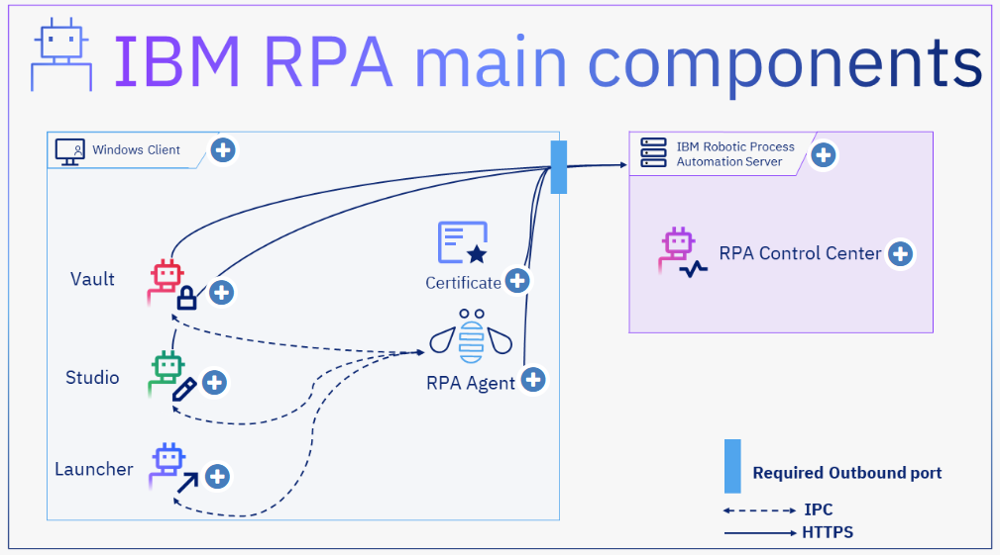

# IBM Robotic Process Automation - Basic I
## 1. Course instructions
To get the most out of a Self-Paced Virtual Class (SPVC), be an active and attentive learner. The following tips can help.
- Try to minimize interruptions. Being interrupted every 10 minutes does not allow you to concentrate on learning. Block one to two hours for a unit and try to complete the lecture and the student exercises for the entire unit.
- Complete the units of the course in order. Many times, material from later units build on earlier units.
  

## 2. Introduction
### 2.1 RPA and RDA
Learn the definition of Robotic Process Automation (RPA), RPA variants, and the advantages of automating processes.
#### （1）What is Robotic Process Automation?
- Robotic Process Automation (RPA) is the automation of computer-centric processes using software robots that can emulate human actions in the computer. These software robots, or bots, can be attended or unattended. 
   
- The processes that are candidates for automation are generally time-consuming and highly repetitive processes, that is, they follow a fixed and long flow, with predefined rules and well-determined input and output parameters.
#### （2）Attended bots or Robotic Desktop Automation
- A specialized type of RPA designed to help humans on their daily tasks by automating the mechanical part of their everyday work. These types of bots require human interaction to be able to complete their automation goal.
#### （3）Unattended bots
- Unattended bots don't need human interaction to complete their automation goal. They might rely on human data input, like documents or email messages.
#### （4）What is hyperautomation?
- Hyperautomation is the combination of advanced technologies such as machine learning, Artificial Intelligence, and process mining, in combination with RPA, to identify and automate significant processes, and also improve existing automation.
#### （5）What are the advantages of automating process?
- Accuracy, since bots eliminate errors during data entry in systems.

- Bots have high availability with uninterrupted executions.

- Bots can process high volumes of data with concurrent processing.

- Integration with legacy systems without the need for customizations.

- Real-time data visualization with dashboards.
### 2.2 IBM RPA main components

#### （1）Windows Client
- The client-side is agent-centric, allowing main communication between client and service.
#### （2）IBM RPA Vault
- The Vault is an IBM RPA tool used to store encrypted credentials. A credential consists basically of sensitive data used during an automated task, like the user and password from a login process.
 

- The Vault has two distinct modes named System Vault and User Vault that can be used simultaneously.
  
The RPA Vault, or System Vault: is recommended for unattended automation, where the process runs in the background and it needs a credential to access a specific system.

The RDA Vault, or User Vault: is recommended for attended automation, where the bot needs human interaction to perform its task. Thus, when a credential is needed, the bot will prompt the user for the Vault's password to access its credentials.
#### （3）IBM RPA Studio
- IBM RPA Studio is the IBM RPA bot authoring tool. IBM RPA Studio is an integrated development environment (IDE) that uses IBM RPA’s proprietary scripting language. 
 
- You can use it to develop, run, test, and publish bots on the platform, requiring no previous experience with programming languages in general. With IBM RPA Studio, you can develop your RPA script by drag and drop function in a modern and intuitive layout. 
 
- Also, IBM RPA Studio has tools that improve the way that you develop your bots, such as Machine Learning tools, PDF handling tools, Regular Expression Builder, workflow files, spreadsheet files, report files, text files and many other features. 
  
#### （4）IBM RPA Launcher
- The IBM RPA Launcher is a client-side component. Use the RPA Launcher to run bots manually on your computer.  
 
- The Launcher interface displays a set of buttons for running robots that the logged-in user has access to.

#### （5）License and Certificate
- The license validates and controls IBM RPA instances available to you. You have a limited amount of licenses to run certain tools and features in the SaaS offering, and you must purchase more instances if you want to run more services using the same license. In the on premises offering, despite the RPA client displaying an unlimited amount of licenses for each RPA tool’s instance, license usage is controlled by IBM License Metric Tool (ILMT) which might charge for additional usage of IBM RPA instances.
 
- The computer certificate verifies if the computer is properly registered to an RPA environment, enabling the connection between the RPA client and server. The certificate in IBM RPA follows the X.509 template and is installed on the computers where the platform was installed.

#### （6）IBM RPA Bot Agent
The IBM RPA Bot Agent is an IBM RPA’s Windows service. By default, the service starts with the operating system and it is responsible for activities such as:
- Log synchronization 
- Schedules 
- Web API, using the 8099 port 
- Execution of bots, using the 8099 port 
- Bot Runtimes 
- Orchestration 
- Licensing 
- Chatbot 
- IVR 
- Web Recorder for Google Chrome 
- SignalR connections hub

#### （7）IBM RPA Server
The server side of IBM RPA manages administration resources and deploy services such as:
- RPA Control Center 
- OCR 
- Antivirus 

#### （8）IBM RPA Control Center
- IBM RPA control center is the control room for managing and auditing resources that are related to your solution environment. It centralizes all operation functions into a robust interface. 
 
- You perform the overall system administration in the RPA control center. You can schedule bots, set bots for manual launching, and orchestrate bots. Bots in the RPA control center are under an embedded revision control system. 
 
- In the RPA control center you can visualize data of bots in operation in dashboards, manage the organization's available computers and active users, among other advanced functions.

## 3. About IBM Robotic Process Automation Studio
### 3.1 Studio Organization
IBM Robotic Process Automation Studio is the integrated development environment (IDE) of IBM RPA. To learn how to use it, see [IBM Robotic Process Automation 21.0.x - IBM Documentation](https://www.ibm.com/docs/en/rpa/21.0)
### 3.2 IBM Robotic Process Automation Language
[IBM Robotic Process Automation Language (kaltura.com)](https://cdnapisec.kaltura.com/html5/html5lib/v2.101/mwEmbedFrame.php/p/1773841/uiconf_id/39954662/entry_id/1_291n2ph1?wid=_1773841&iframeembed=true&playerId=kaltura_player&entry_id=1_291n2ph1&flashvars[akamaiHD.loadingPolicy]=preInitialize&flashvars[akamaiHD.asyncInit]=true&flashvars[twoPhaseManifest]=true&flashvars[streamerType]=hdnetworkmanifest&flashvars[localizationCode]=en&flashvars[leadWithHTML5]=true&flashvars[sideBarContainer.plugin]=true&flashvars[sideBarContainer.position]=left&flashvars[sideBarContainer.clickToClose]=true&flashvars[chapters.plugin]=true&flashvars[chapters.layout]=vertical&flashvars[chapters.thumbnailRotator]=false&flashvars[streamSelector.plugin]=true&flashvars[EmbedPlayer.SpinnerTarget]=videoHolder&flashvars[dualScreen.plugin]=true&flashvars[Kaltura.addCrossoriginToIframe]=true&&wid=1_4c61hm92)
### 3.3 Script, Designer and Call Graph
[Script, Designer and Call Graph (kaltura.com)](https://cdnapisec.kaltura.com/html5/html5lib/v2.101/mwEmbedFrame.php/p/1773841/uiconf_id/39954662/entry_id/1_225f8053?wid=_1773841&iframeembed=true&playerId=kaltura_player&entry_id=1_225f8053&flashvars[akamaiHD.loadingPolicy]=preInitialize&flashvars[akamaiHD.asyncInit]=true&flashvars[twoPhaseManifest]=true&flashvars[streamerType]=hdnetworkmanifest&flashvars[localizationCode]=en&flashvars[leadWithHTML5]=true&flashvars[sideBarContainer.plugin]=true&flashvars[sideBarContainer.position]=left&flashvars[sideBarContainer.clickToClose]=true&flashvars[chapters.plugin]=true&flashvars[chapters.layout]=vertical&flashvars[chapters.thumbnailRotator]=false&flashvars[streamSelector.plugin]=true&flashvars[EmbedPlayer.SpinnerTarget]=videoHolder&flashvars[dualScreen.plugin]=true&flashvars[Kaltura.addCrossoriginToIframe]=true&&wid=1_mcljcb2s)
### 3.4 Debugger
[Debugger (kaltura.com)](https://cdnapisec.kaltura.com/html5/html5lib/v2.101/mwEmbedFrame.php/p/1773841/uiconf_id/39954662/entry_id/1_pnxxmuvc?wid=_1773841&iframeembed=true&playerId=kaltura_player&entry_id=1_pnxxmuvc&flashvars[akamaiHD.loadingPolicy]=preInitialize&flashvars[akamaiHD.asyncInit]=true&flashvars[twoPhaseManifest]=true&flashvars[streamerType]=hdnetworkmanifest&flashvars[localizationCode]=en&flashvars[leadWithHTML5]=true&flashvars[sideBarContainer.plugin]=true&flashvars[sideBarContainer.position]=left&flashvars[sideBarContainer.clickToClose]=true&flashvars[chapters.plugin]=true&flashvars[chapters.layout]=vertical&flashvars[chapters.thumbnailRotator]=false&flashvars[streamSelector.plugin]=true&flashvars[EmbedPlayer.SpinnerTarget]=videoHolder&flashvars[dualScreen.plugin]=true&flashvars[Kaltura.addCrossoriginToIframe]=true&&wid=1_ckjysolh)
## 4. Publishing, Repository and Revision Control
[Publishing, Repository and Revision Control (kaltura.com)](https://cdnapisec.kaltura.com/html5/html5lib/v2.101/mwEmbedFrame.php/p/1773841/uiconf_id/39954662/entry_id/1_6ep46w1z?wid=_1773841&iframeembed=true&playerId=kaltura_player&entry_id=1_6ep46w1z&flashvars[akamaiHD.loadingPolicy]=preInitialize&flashvars[akamaiHD.asyncInit]=true&flashvars[twoPhaseManifest]=true&flashvars[streamerType]=hdnetworkmanifest&flashvars[localizationCode]=en&flashvars[leadWithHTML5]=true&flashvars[sideBarContainer.plugin]=true&flashvars[sideBarContainer.position]=left&flashvars[sideBarContainer.clickToClose]=true&flashvars[chapters.plugin]=true&flashvars[chapters.layout]=vertical&flashvars[chapters.thumbnailRotator]=false&flashvars[streamSelector.plugin]=true&flashvars[EmbedPlayer.SpinnerTarget]=videoHolder&flashvars[dualScreen.plugin]=true&flashvars[Kaltura.addCrossoriginToIframe]=true&&wid=1_ikvlr8s3)
## 5. Basic commands and variables
### 5.1 Variables
[Variables (kaltura.com)](https://cdnapisec.kaltura.com/html5/html5lib/v2.101/mwEmbedFrame.php/p/1773841/uiconf_id/39954662/entry_id/1_wgwqyuoq?wid=_1773841&iframeembed=true&playerId=kaltura_player&entry_id=1_wgwqyuoq&flashvars[akamaiHD.loadingPolicy]=preInitialize&flashvars[akamaiHD.asyncInit]=true&flashvars[twoPhaseManifest]=true&flashvars[streamerType]=hdnetworkmanifest&flashvars[localizationCode]=en&flashvars[leadWithHTML5]=true&flashvars[sideBarContainer.plugin]=true&flashvars[sideBarContainer.position]=left&flashvars[sideBarContainer.clickToClose]=true&flashvars[chapters.plugin]=true&flashvars[chapters.layout]=vertical&flashvars[chapters.thumbnailRotator]=false&flashvars[streamSelector.plugin]=true&flashvars[EmbedPlayer.SpinnerTarget]=videoHolder&flashvars[dualScreen.plugin]=true&flashvars[Kaltura.addCrossoriginToIframe]=true&&wid=1_q520ec34)
### 5.2 Variables - Use case I
[Variables - Use case I (kaltura.com)](https://cdnapisec.kaltura.com/html5/html5lib/v2.101/mwEmbedFrame.php/p/1773841/uiconf_id/39954662/entry_id/1_dftmt0th?wid=_1773841&iframeembed=true&playerId=kaltura_player&entry_id=1_dftmt0th&flashvars[akamaiHD.loadingPolicy]=preInitialize&flashvars[akamaiHD.asyncInit]=true&flashvars[twoPhaseManifest]=true&flashvars[streamerType]=hdnetworkmanifest&flashvars[localizationCode]=en&flashvars[leadWithHTML5]=true&flashvars[sideBarContainer.plugin]=true&flashvars[sideBarContainer.position]=left&flashvars[sideBarContainer.clickToClose]=true&flashvars[chapters.plugin]=true&flashvars[chapters.layout]=vertical&flashvars[chapters.thumbnailRotator]=false&flashvars[streamSelector.plugin]=true&flashvars[EmbedPlayer.SpinnerTarget]=videoHolder&flashvars[dualScreen.plugin]=true&flashvars[Kaltura.addCrossoriginToIframe]=true&&wid=1_hi4dzt16)
### 5.3 Variables - Use case II
[Variables - Use case II (kaltura.com)](https://cdnapisec.kaltura.com/html5/html5lib/v2.101/mwEmbedFrame.php/p/1773841/uiconf_id/39954662/entry_id/1_0rdokrex?wid=_1773841&iframeembed=true&playerId=kaltura_player&entry_id=1_0rdokrex&flashvars[akamaiHD.loadingPolicy]=preInitialize&flashvars[akamaiHD.asyncInit]=true&flashvars[twoPhaseManifest]=true&flashvars[streamerType]=hdnetworkmanifest&flashvars[localizationCode]=en&flashvars[leadWithHTML5]=true&flashvars[sideBarContainer.plugin]=true&flashvars[sideBarContainer.position]=left&flashvars[sideBarContainer.clickToClose]=true&flashvars[chapters.plugin]=true&flashvars[chapters.layout]=vertical&flashvars[chapters.thumbnailRotator]=false&flashvars[streamSelector.plugin]=true&flashvars[EmbedPlayer.SpinnerTarget]=videoHolder&flashvars[dualScreen.plugin]=true&flashvars[Kaltura.addCrossoriginToIframe]=true&&wid=1_g79mzwoi)
### 5.4 Flow control
[Flow control (kaltura.com)](https://cdnapisec.kaltura.com/html5/html5lib/v2.101/mwEmbedFrame.php/p/1773841/uiconf_id/39954662/entry_id/1_y4w17zea?wid=_1773841&iframeembed=true&playerId=kaltura_player&entry_id=1_y4w17zea&flashvars[akamaiHD.loadingPolicy]=preInitialize&flashvars[akamaiHD.asyncInit]=true&flashvars[twoPhaseManifest]=true&flashvars[streamerType]=hdnetworkmanifest&flashvars[localizationCode]=en&flashvars[leadWithHTML5]=true&flashvars[sideBarContainer.plugin]=true&flashvars[sideBarContainer.position]=left&flashvars[sideBarContainer.clickToClose]=true&flashvars[chapters.plugin]=true&flashvars[chapters.layout]=vertical&flashvars[chapters.thumbnailRotator]=false&flashvars[streamSelector.plugin]=true&flashvars[EmbedPlayer.SpinnerTarget]=videoHolder&flashvars[dualScreen.plugin]=true&flashvars[Kaltura.addCrossoriginToIframe]=true&&wid=1_oy5tv0l2)
### 5.5 Log message
[Log message (kaltura.com)](https://cdnapisec.kaltura.com/html5/html5lib/v2.101/mwEmbedFrame.php/p/1773841/uiconf_id/39954662/entry_id/1_bffr23e3?wid=_1773841&iframeembed=true&playerId=kaltura_player&entry_id=1_bffr23e3&flashvars[akamaiHD.loadingPolicy]=preInitialize&flashvars[akamaiHD.asyncInit]=true&flashvars[twoPhaseManifest]=true&flashvars[streamerType]=hdnetworkmanifest&flashvars[localizationCode]=en&flashvars[leadWithHTML5]=true&flashvars[sideBarContainer.plugin]=true&flashvars[sideBarContainer.position]=left&flashvars[sideBarContainer.clickToClose]=true&flashvars[chapters.plugin]=true&flashvars[chapters.layout]=vertical&flashvars[chapters.thumbnailRotator]=false&flashvars[streamSelector.plugin]=true&flashvars[EmbedPlayer.SpinnerTarget]=videoHolder&flashvars[dualScreen.plugin]=true&flashvars[Kaltura.addCrossoriginToIframe]=true&&wid=1_bk4t55ql)
### 5.6 Input Box and Show Message Box
[Input Box and Show Message Box (kaltura.com)](https://cdnapisec.kaltura.com/html5/html5lib/v2.101/mwEmbedFrame.php/p/1773841/uiconf_id/39954662/entry_id/1_3xwtm6uq?wid=_1773841&iframeembed=true&playerId=kaltura_player&entry_id=1_3xwtm6uq&flashvars[akamaiHD.loadingPolicy]=preInitialize&flashvars[akamaiHD.asyncInit]=true&flashvars[twoPhaseManifest]=true&flashvars[streamerType]=hdnetworkmanifest&flashvars[localizationCode]=en&flashvars[leadWithHTML5]=true&flashvars[sideBarContainer.plugin]=true&flashvars[sideBarContainer.position]=left&flashvars[sideBarContainer.clickToClose]=true&flashvars[chapters.plugin]=true&flashvars[chapters.layout]=vertical&flashvars[chapters.thumbnailRotator]=false&flashvars[streamSelector.plugin]=true&flashvars[EmbedPlayer.SpinnerTarget]=videoHolder&flashvars[dualScreen.plugin]=true&flashvars[Kaltura.addCrossoriginToIframe]=true&&wid=1_pf9wvg46)
## 6. Advanced commands
### 6.1 File Manipulation I
[File Manipulation I (kaltura.com)](https://cdnapisec.kaltura.com/html5/html5lib/v2.101/mwEmbedFrame.php/p/1773841/uiconf_id/39954662/entry_id/1_fhea0cbe?wid=_1773841&iframeembed=true&playerId=kaltura_player&entry_id=1_fhea0cbe&flashvars[akamaiHD.loadingPolicy]=preInitialize&flashvars[akamaiHD.asyncInit]=true&flashvars[twoPhaseManifest]=true&flashvars[streamerType]=hdnetworkmanifest&flashvars[localizationCode]=en&flashvars[leadWithHTML5]=true&flashvars[sideBarContainer.plugin]=true&flashvars[sideBarContainer.position]=left&flashvars[sideBarContainer.clickToClose]=true&flashvars[chapters.plugin]=true&flashvars[chapters.layout]=vertical&flashvars[chapters.thumbnailRotator]=false&flashvars[streamSelector.plugin]=true&flashvars[EmbedPlayer.SpinnerTarget]=videoHolder&flashvars[dualScreen.plugin]=true&flashvars[Kaltura.addCrossoriginToIframe]=true&&wid=1_l6x68is8)
### 6.2 File Manipulation II
[File Manipulation II (kaltura.com)](https://cdnapisec.kaltura.com/html5/html5lib/v2.101/mwEmbedFrame.php/p/1773841/uiconf_id/39954662/entry_id/1_yos0awg1?wid=_1773841&iframeembed=true&playerId=kaltura_player&entry_id=1_yos0awg1&flashvars[akamaiHD.loadingPolicy]=preInitialize&flashvars[akamaiHD.asyncInit]=true&flashvars[twoPhaseManifest]=true&flashvars[streamerType]=hdnetworkmanifest&flashvars[localizationCode]=en&flashvars[leadWithHTML5]=true&flashvars[sideBarContainer.plugin]=true&flashvars[sideBarContainer.position]=left&flashvars[sideBarContainer.clickToClose]=true&flashvars[chapters.plugin]=true&flashvars[chapters.layout]=vertical&flashvars[chapters.thumbnailRotator]=false&flashvars[streamSelector.plugin]=true&flashvars[EmbedPlayer.SpinnerTarget]=videoHolder&flashvars[dualScreen.plugin]=true&flashvars[Kaltura.addCrossoriginToIframe]=true&&wid=1_oi2irjhu)
### 6.3 File Manipulation III
[File Manipulation III (kaltura.com)](https://cdnapisec.kaltura.com/html5/html5lib/v2.101/mwEmbedFrame.php/p/1773841/uiconf_id/39954662/entry_id/1_bkfep11x?wid=_1773841&iframeembed=true&playerId=kaltura_player&entry_id=1_bkfep11x&flashvars[akamaiHD.loadingPolicy]=preInitialize&flashvars[akamaiHD.asyncInit]=true&flashvars[twoPhaseManifest]=true&flashvars[streamerType]=hdnetworkmanifest&flashvars[localizationCode]=en&flashvars[leadWithHTML5]=true&flashvars[sideBarContainer.plugin]=true&flashvars[sideBarContainer.position]=left&flashvars[sideBarContainer.clickToClose]=true&flashvars[chapters.plugin]=true&flashvars[chapters.layout]=vertical&flashvars[chapters.thumbnailRotator]=false&flashvars[streamSelector.plugin]=true&flashvars[EmbedPlayer.SpinnerTarget]=videoHolder&flashvars[dualScreen.plugin]=true&flashvars[Kaltura.addCrossoriginToIframe]=true&&wid=1_vg6vf1da)
### 6.4 Queue, stack and list
[Queue, stack and list (kaltura.com)](https://cdnapisec.kaltura.com/html5/html5lib/v2.101/mwEmbedFrame.php/p/1773841/uiconf_id/39954662/entry_id/1_mtwxxm5b?wid=_1773841&iframeembed=true&playerId=kaltura_player&entry_id=1_mtwxxm5b&flashvars[akamaiHD.loadingPolicy]=preInitialize&flashvars[akamaiHD.asyncInit]=true&flashvars[twoPhaseManifest]=true&flashvars[streamerType]=hdnetworkmanifest&flashvars[localizationCode]=en&flashvars[leadWithHTML5]=true&flashvars[sideBarContainer.plugin]=true&flashvars[sideBarContainer.position]=left&flashvars[sideBarContainer.clickToClose]=true&flashvars[chapters.plugin]=true&flashvars[chapters.layout]=vertical&flashvars[chapters.thumbnailRotator]=false&flashvars[streamSelector.plugin]=true&flashvars[EmbedPlayer.SpinnerTarget]=videoHolder&flashvars[dualScreen.plugin]=true&flashvars[Kaltura.addCrossoriginToIframe]=true&&wid=1_ttd4wf9m)
### 6.5 Use case I - List
[Use case I - List (kaltura.com)](https://cdnapisec.kaltura.com/html5/html5lib/v2.101/mwEmbedFrame.php/p/1773841/uiconf_id/39954662/entry_id/1_2ju93ey1?wid=_1773841&iframeembed=true&playerId=kaltura_player&entry_id=1_2ju93ey1&flashvars[akamaiHD.loadingPolicy]=preInitialize&flashvars[akamaiHD.asyncInit]=true&flashvars[twoPhaseManifest]=true&flashvars[streamerType]=hdnetworkmanifest&flashvars[localizationCode]=en&flashvars[leadWithHTML5]=true&flashvars[sideBarContainer.plugin]=true&flashvars[sideBarContainer.position]=left&flashvars[sideBarContainer.clickToClose]=true&flashvars[chapters.plugin]=true&flashvars[chapters.layout]=vertical&flashvars[chapters.thumbnailRotator]=false&flashvars[streamSelector.plugin]=true&flashvars[EmbedPlayer.SpinnerTarget]=videoHolder&flashvars[dualScreen.plugin]=true&flashvars[Kaltura.addCrossoriginToIframe]=true&&wid=1_h02qpncy)
### 6.6 Use case II - Stack
[Use case II - Stack (kaltura.com)](https://cdnapisec.kaltura.com/html5/html5lib/v2.101/mwEmbedFrame.php/p/1773841/uiconf_id/39954662/entry_id/1_wbjk4bn8?wid=_1773841&iframeembed=true&playerId=kaltura_player&entry_id=1_wbjk4bn8&flashvars[akamaiHD.loadingPolicy]=preInitialize&flashvars[akamaiHD.asyncInit]=true&flashvars[twoPhaseManifest]=true&flashvars[streamerType]=hdnetworkmanifest&flashvars[localizationCode]=en&flashvars[leadWithHTML5]=true&flashvars[sideBarContainer.plugin]=true&flashvars[sideBarContainer.position]=left&flashvars[sideBarContainer.clickToClose]=true&flashvars[chapters.plugin]=true&flashvars[chapters.layout]=vertical&flashvars[chapters.thumbnailRotator]=false&flashvars[streamSelector.plugin]=true&flashvars[EmbedPlayer.SpinnerTarget]=videoHolder&flashvars[dualScreen.plugin]=true&flashvars[Kaltura.addCrossoriginToIframe]=true&&wid=1_can5jfl7)
### 6.7 Use case III - Queue
[Use case III - Queue (kaltura.com)](https://cdnapisec.kaltura.com/html5/html5lib/v2.101/mwEmbedFrame.php/p/1773841/uiconf_id/39954662/entry_id/1_s0dw5z22?wid=_1773841&iframeembed=true&playerId=kaltura_player&entry_id=1_s0dw5z22&flashvars[akamaiHD.loadingPolicy]=preInitialize&flashvars[akamaiHD.asyncInit]=true&flashvars[twoPhaseManifest]=true&flashvars[streamerType]=hdnetworkmanifest&flashvars[localizationCode]=en&flashvars[leadWithHTML5]=true&flashvars[sideBarContainer.plugin]=true&flashvars[sideBarContainer.position]=left&flashvars[sideBarContainer.clickToClose]=true&flashvars[chapters.plugin]=true&flashvars[chapters.layout]=vertical&flashvars[chapters.thumbnailRotator]=false&flashvars[streamSelector.plugin]=true&flashvars[EmbedPlayer.SpinnerTarget]=videoHolder&flashvars[dualScreen.plugin]=true&flashvars[Kaltura.addCrossoriginToIframe]=true&&wid=1_1g6ogqmn)
### 6.8 List manipulation
[List manipulation (kaltura.com)](https://cdnapisec.kaltura.com/html5/html5lib/v2.101/mwEmbedFrame.php/p/1773841/uiconf_id/39954662/entry_id/1_yantxgf8?wid=_1773841&iframeembed=true&playerId=kaltura_player&entry_id=1_yantxgf8&flashvars[akamaiHD.loadingPolicy]=preInitialize&flashvars[akamaiHD.asyncInit]=true&flashvars[twoPhaseManifest]=true&flashvars[streamerType]=hdnetworkmanifest&flashvars[localizationCode]=en&flashvars[leadWithHTML5]=true&flashvars[sideBarContainer.plugin]=true&flashvars[sideBarContainer.position]=left&flashvars[sideBarContainer.clickToClose]=true&flashvars[chapters.plugin]=true&flashvars[chapters.layout]=vertical&flashvars[chapters.thumbnailRotator]=false&flashvars[streamSelector.plugin]=true&flashvars[EmbedPlayer.SpinnerTarget]=videoHolder&flashvars[dualScreen.plugin]=true&flashvars[Kaltura.addCrossoriginToIframe]=true&&wid=1_eprq5ulk)
### 6.9 Foreach
[Foreach (kaltura.com)](https://cdnapisec.kaltura.com/html5/html5lib/v2.101/mwEmbedFrame.php/p/1773841/uiconf_id/39954662/entry_id/1_ynaq22lp?wid=_1773841&iframeembed=true&playerId=kaltura_player&entry_id=1_ynaq22lp&flashvars[akamaiHD.loadingPolicy]=preInitialize&flashvars[akamaiHD.asyncInit]=true&flashvars[twoPhaseManifest]=true&flashvars[streamerType]=hdnetworkmanifest&flashvars[localizationCode]=en&flashvars[leadWithHTML5]=true&flashvars[sideBarContainer.plugin]=true&flashvars[sideBarContainer.position]=left&flashvars[sideBarContainer.clickToClose]=true&flashvars[chapters.plugin]=true&flashvars[chapters.layout]=vertical&flashvars[chapters.thumbnailRotator]=false&flashvars[streamSelector.plugin]=true&flashvars[EmbedPlayer.SpinnerTarget]=videoHolder&flashvars[dualScreen.plugin]=true&flashvars[Kaltura.addCrossoriginToIframe]=true&&wid=1_60m45cds)
### 6.10 Text Manipulation I
[Text Manipulation I (kaltura.com)](https://cdnapisec.kaltura.com/html5/html5lib/v2.101/mwEmbedFrame.php/p/1773841/uiconf_id/39954662/entry_id/1_t3nlvk5g?wid=_1773841&iframeembed=true&playerId=kaltura_player&entry_id=1_t3nlvk5g&flashvars[akamaiHD.loadingPolicy]=preInitialize&flashvars[akamaiHD.asyncInit]=true&flashvars[twoPhaseManifest]=true&flashvars[streamerType]=hdnetworkmanifest&flashvars[localizationCode]=en&flashvars[leadWithHTML5]=true&flashvars[sideBarContainer.plugin]=true&flashvars[sideBarContainer.position]=left&flashvars[sideBarContainer.clickToClose]=true&flashvars[chapters.plugin]=true&flashvars[chapters.layout]=vertical&flashvars[chapters.thumbnailRotator]=false&flashvars[streamSelector.plugin]=true&flashvars[EmbedPlayer.SpinnerTarget]=videoHolder&flashvars[dualScreen.plugin]=true&flashvars[Kaltura.addCrossoriginToIframe]=true&&wid=1_nc72jtnh)
### 6.11 Text Manipulation II
[Text Manipulation II (kaltura.com)](https://cdnapisec.kaltura.com/html5/html5lib/v2.101/mwEmbedFrame.php/p/1773841/uiconf_id/39954662/entry_id/1_x9mfnzmz?wid=_1773841&iframeembed=true&playerId=kaltura_player&entry_id=1_x9mfnzmz&flashvars[akamaiHD.loadingPolicy]=preInitialize&flashvars[akamaiHD.asyncInit]=true&flashvars[twoPhaseManifest]=true&flashvars[streamerType]=hdnetworkmanifest&flashvars[localizationCode]=en&flashvars[leadWithHTML5]=true&flashvars[sideBarContainer.plugin]=true&flashvars[sideBarContainer.position]=left&flashvars[sideBarContainer.clickToClose]=true&flashvars[chapters.plugin]=true&flashvars[chapters.layout]=vertical&flashvars[chapters.thumbnailRotator]=false&flashvars[streamSelector.plugin]=true&flashvars[EmbedPlayer.SpinnerTarget]=videoHolder&flashvars[dualScreen.plugin]=true&flashvars[Kaltura.addCrossoriginToIframe]=true&&wid=1_i0lc1jus)
## 7. Routines
[Routines (kaltura.com)](https://cdnapisec.kaltura.com/html5/html5lib/v2.101/mwEmbedFrame.php/p/1773841/uiconf_id/39954662/entry_id/1_qjwum31x?wid=_1773841&iframeembed=true&playerId=kaltura_player&entry_id=1_qjwum31x&flashvars[akamaiHD.loadingPolicy]=preInitialize&flashvars[akamaiHD.asyncInit]=true&flashvars[twoPhaseManifest]=true&flashvars[streamerType]=hdnetworkmanifest&flashvars[localizationCode]=en&flashvars[leadWithHTML5]=true&flashvars[sideBarContainer.plugin]=true&flashvars[sideBarContainer.position]=left&flashvars[sideBarContainer.clickToClose]=true&flashvars[chapters.plugin]=true&flashvars[chapters.layout]=vertical&flashvars[chapters.thumbnailRotator]=false&flashvars[streamSelector.plugin]=true&flashvars[EmbedPlayer.SpinnerTarget]=videoHolder&flashvars[dualScreen.plugin]=true&flashvars[Kaltura.addCrossoriginToIframe]=true&&wid=1_0a58jf84)