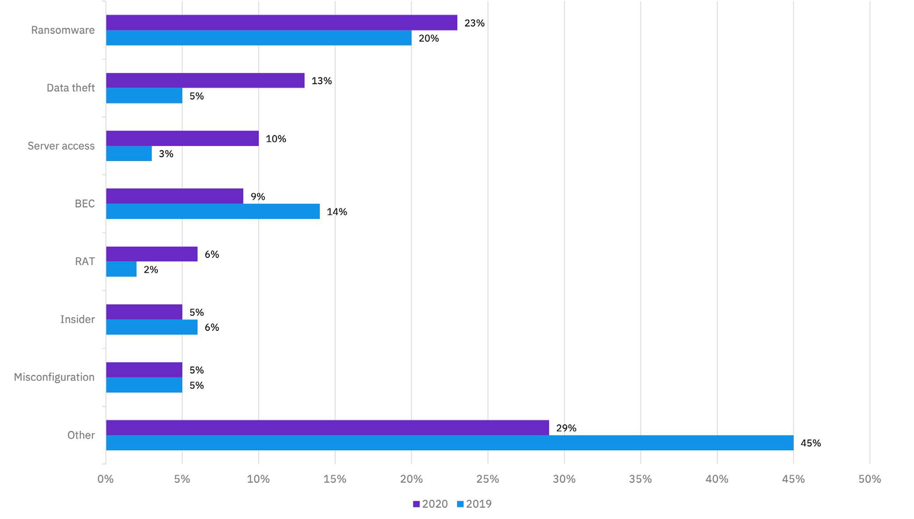
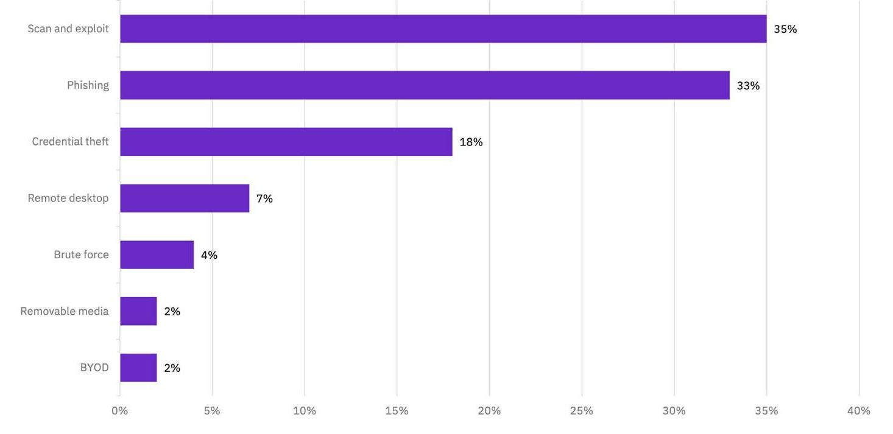
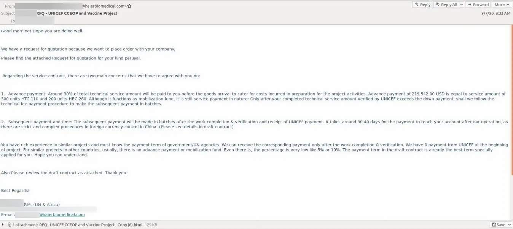
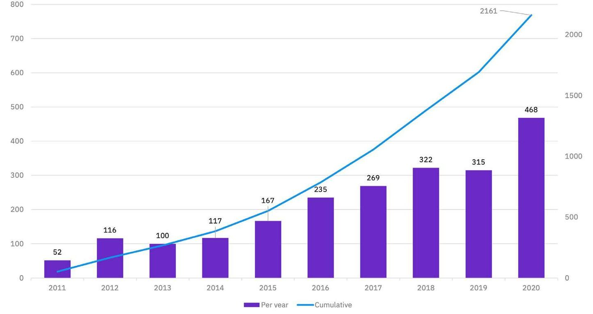
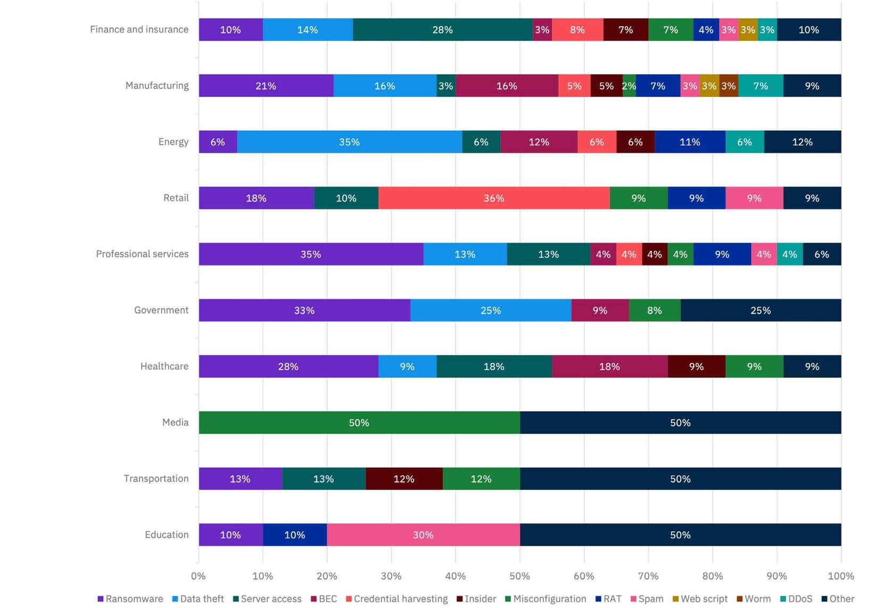
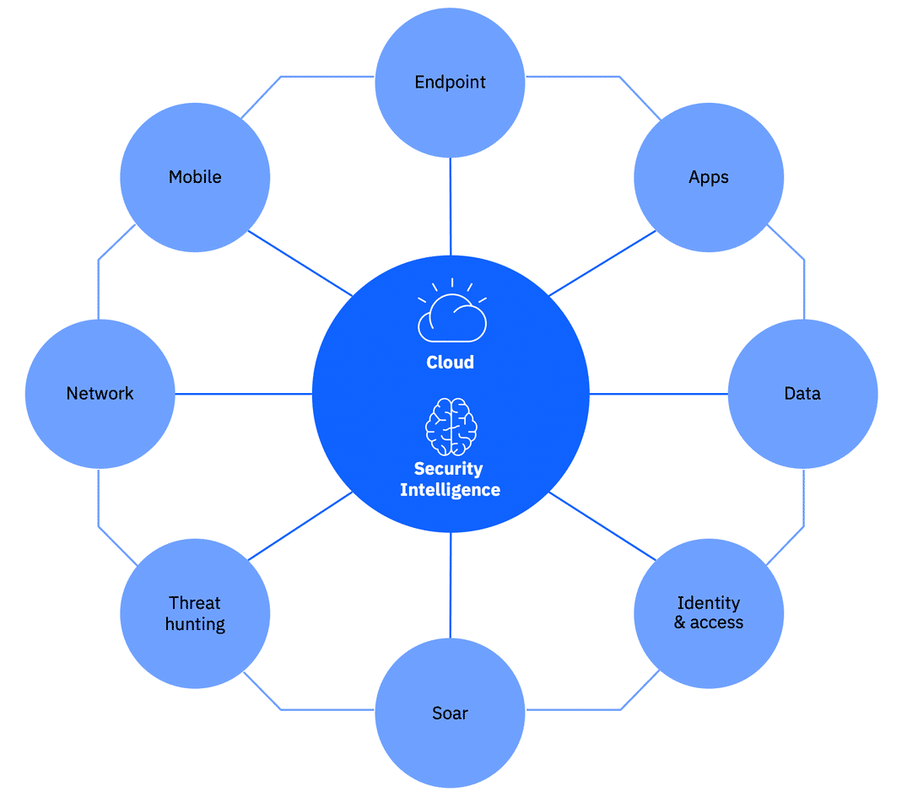

# Getting Started with Threat Intelligence and Hunting

## **Module One: Threat Intelligence**   

## **Topic 1: Reasons Behind Cyber Attacks**

*Cyber attackers have an arsenal of sophisticated weapons at their disposal, let's explore the most used ones*

### **Introduction**

In this topic, we will explore what is a cyber threat, why do they happen, and which methods do 'bad actors' use to carry out attacks on organizations. 

Throughout this topic, we will attempt to answer the following questions: 

1. Why are cyber threats so important? 
2. Why do cyber attackers, attack?  

### **1. Why are cyber threats so important?** 

*Cyber threats are deliberate exploitations of computer systems and networks using malicious software (malware) to compromise data or disable operations.*

Cyber attacks enable cyber-crimes like information theft, fraud and ransomware schemes. 

**Why does this matter?**

**Let's understand the risk through an example.**

Your intelligent building or the entire city could be hacked today.

Given that most modern office buildings have switched to electronic access controls, hackers could simply deactivate all locks across the building, instantly rendering the entire facility unsecured, doors flapping in the breeze, and causing mass panic among his guards.

Or, they could move to paralyze the entire city, cutting power to every major building, while activating fire alarms across the city and manipulating traffic signals to cause massive traffic accidents and trap first responders helplessly across the city and preventing them from reaching their next appointments. 

**Yet, here’s where things get far more worrying.**

When they step on the elevator to change floors, those hackers could disable the elevator system and trap them, disrupting his visit and generating media images of him being helplessly dragged up a ladder to safety.

Or they could trigger the fire alarms or overheat a piece of equipment to cause a real fire and activate the sprinkler system, leading to images of a soaked and miserable leader cutting their visit short.

Now imagine that happening in a hospital, in your children's school, in a nearby prison or other critical buildings such as airports, dams or nuclear plants.

**How could this happen?**

>Cyber attacks don’t always originate outside organizations. 

>"According to white hat Dark Web professionals at Black Hat, it appears that many hackers are certified professionals who operate as trusted time bombs and have already penetrated most organizations."

>ITBizAdvisor

**Types of Attacks**

Let's explore below the most common types of attacks identified by our cybersecurity teams: 

**Physical Access**

Incidents where the attacker acquires access to the physical system, this could include from phones, computers or servers, to ATMs, elevators, cars, airplanes, CCTV, homes, and health monitors. 

When Cybersecurity meets Physical Security, hackers could monitor all of the traffic cameras in the area to watch the head of state’s movements in real-time and monitor his or her schedule second by second. As they enter a building, the local CCTV cameras throughout that building could be used to surveil their movements and compile an intelligence list of everyone they meet with. 

**Brute Force**

Use of trial and error to obtain a username and password for a valid account on an application to access sensitive data such as credit card numbers.

A brute force attack can manifest itself in many different ways but primarily consists of an attacker configuring predetermined values, making requests to a server using those values, and then analyzing the response. For the sake of efficiency, an attacker may use a dictionary attack (with or without mutations) or a traditional brute-force attack (with given classes of characters e.g.: alphanumerical, special, case (in) sensitive). Considering a given method, the number of tries, the efficiency of the system which conducts the attack, and the estimated efficiency of the system which is attacked the attacker is able to calculate approximately how long it will take to submit all chosen predetermined values. 

**Misconfiguration or Human Error**

Incidents where attackers gain access to vulnerable systems, left exposed by inexperienced administrators or users (e.g., default factory settings).  

**Misconfigured Clouds, Phishing and Other Insider-inflicted Weaknesses**

With mobility and bring-your-own-device (BYOD) trends being the norm in today’s workplace and productivity, many say that everyone is an insider threat. Does this outlook materialize in real-world security incidents? The numbers paint a grim picture.

As gleaned from information on publicly disclosed breaches, there were several high-profile breaches eventually attributed to the errors of inadvertent insiders.

Some of the most common scenarios included basic misjudgment. These include employees storing intellectual property on their own insecure personal devices and end systems and employees and insiders falling for phishing emails that resulted in account takeover or access to sensitive data. In addition, erroneous permission-level attribution on cloud services and networked backups exposed sensitive data through weak or non-existent authentication.

The following sections provide further details on the most prominent incident types attributed to inadvertent insiders affecting organizations

**Misconfigured clouds**

Misconfigured cloud servers, networked backup incidents and other improperly configured systems were responsible for the exposure of more than 2 billion records, or nearly 70 percent of the total number of compromised records tracked by X-Force. There were 424% more records compromised as a result of these types of incidents year on year.

**Malvertising**

Using sophisticated tools to conceal malware within objects or images in advertising network ads, getting into user’s computer, even if they don’t click on the ad. 

**How Malvertising Works**

In most cases, threat actors create fake advertisements laden with malware and try to slip them past security checks at large ad networks. These infected ads can then sneak malware onto a web user’s computer, even if he or she doesn’t click on the ad. These so-called drive-by downloads are particularly effective against users who don’t regularly update their software.

The cost of malvertising is huge: A report from ad verification vendor GeoEdge estimated that the threat costs the online advertising industry more than $1.1 billion a year, and anticipated the cost rising another 20–30 percent in the upcoming years.

**Watering Hole**

A cyber attack in which the attacker seeks to compromise a specific group of end users by infecting websites that members of the group are known to visit. 

For example - recent reports surfaced indicating that attackers used a watering-hole attack by compromising the web servers of a Polish financial regulator, the website of the National Banking and Securities Commission of Mexico, and the website of a state-owned bank in Uruguay. With suspected links to the threat actor known as the Lazarus Group, attackers targeted more than 100 entities and successfully infected at least 30 organizations with malware that was used to exfiltrate data and money from their internal networks over an encrypted tunnel. 

**Phishing**

Tricking a user into providing protected information or downloading malware by typically using the email that appears to be from a trusted or reputable source. 

Losses due to cybercrime are a growing issue for financial organizations across the globe, and seeing this sector top the chart is not a surprise. Attackers are committing direct monetary theft from bank accounts by using phishing and credential-stealing malware, as well as running malicious code to intercept online transactions. Attacks on the financial sector more commonly target bank customers, but organized crime gangs are also after the enterprise networks of those organizations. 

**SQL Injection**

The attack inserts database (where data is stored) commands in client applications, allowing the hacker to read and modify sensitive data, execute database administration operations. 

A SQL injection attack consists of the insertion or "injection" of a SQL (Structured Query Language is a language used to manipulate data) request via the input data from the client to the application. A successful SQL injection exploit can read sensitive data from the database, modify database data (Insert/Update/Delete), execute administration operations on the database (such as shutdown the DBMS, acronym for Database Management System), recover the content of a given file present on the DBMS file system and in some cases issue commands to the operating system. SQL injection attacks are a type of injection attack, in which SQL commands are injected into data-plane input in order to affect the execution of predefined SQL commands. 

**Denial of Service (DDoS)**

These attacks overload online networks and systems with massive traffic consuming resources and bandwidth, eventually shutting down their online capabilities. 

**Malware**

Malicious software programmed to attack a target computer. It can block access, steal data, make systems inoperable, and even physically destroy them. 

Malware is the chief weapon of a cyber attack and includes viruses, worms, trojans, ransomware, adware, spyware bots, bugs and rootkits.

It installs when a user clicks a link or takes an action, once inside, malware can block access to data and programs, steal information and make systems inoperable.

Ransomware is malware used to blackmail victims by threatening to publish sensitive information or locking users out until a ransom is paid — often in cryptocurrency such as Bitcoin. IBM estimates ransomware attacks cost companies more than $8 billion globally.

Zero-day exploits introduce malware through vulnerabilities unknown to the maker or user of software or systems. It is “zero-day” because developers have had zero-time to address or patch the vulnerability. 

**There are also sub-types of malware based on their lifecycle**

* Malware offspring - A new version of malware that is thought to be created by the same developer as another type of malware.
* Overlay malware - A type of mobile malware designed to mimic the look and feel of a legitimate, target application.
* Malware family - Malware is thought to be linked to botnets and other malware operators.
* Malware hybrid - New malware incorporating characteristics of two types of malware.
  

### **2. Why do cyber attackers, attack?** 

*Cyber attacks are perpetrated for financial gain through crimes like fraud or extortion, as with ransomware. There are cases where sabotage or revenge are factors. Think disgruntled employee. Cyber attacks also have a political dimension and are used in cyber-warfare.*

**Reasons behind cyber attacks**

Reasons for the attack can range from politics to bragging rights. Military and government targets include power grids and military bases. Civil and private sector corporations are targeted on their web servers and databases. 

Some of the main reasons for cyber attacks are listed below: 

* Military
* Civil/private sector 
* Hacktivism
* Legitimate research
* Bragging rights

**What is the impact on businesses?**

The cost to businesses from cyber attacks and their consequences, such as data breaches, are devastating. According to the latest Cost of a Data Breach Study by Ponemon Institute, the average total cost of a data breach is close to $4 million USD.

Additionally, companies attacks can have the following impact:

* Damage brands and reputations
* Erode and even decimate customer loyalty
* Result in loss of intellectual property
* Put companies out of business
* Invite regulatory penalties
* Impair security for governments and states
* Increase potential for future attacks

**How can companies defend themselves?**

Year-by-year shifts in the cybercrime arena do not necessarily mean that much is changing in the way online fraud works or the tools cybercrime gangs are using to work it. 

**The real change has to come from the defenders’ side**

The cybercriminal lifecycle has to be shortened to render it less and less lucrative over time. The faster we react to cybercrime findings and share them across the entire community, the less time each malware variant will realize successful fraud attacks.

With increased vigilance, stronger detection, and quicker reaction times, criminal operations can become much less financially viable for attackers.

Fraudsters will be forced to abandon the field for lack of profit.

**Bringing it all together**

In the video below your instructor will guide you through these concepts 

### **Summary**

1. Cyber threats are deliberate exploitations of computer systems and networks using malicious software (malware) to compromise data or disable operations. 

2. There are many types of ways in which malicious hackers can perform cyber attacks beyond traditional Physical Access, some of them are using Malware, DDoS, Brute Force, Phishing, and/or Misconfiguration. 

3. With increased vigilance, stronger detection, and quicker reaction times, criminal operations can become much less financially viable for attackers. 

## **Topic 2: Global Threat Trends**

*Let's gain a better understanding of the threat landscape understanding attack trends on a global scale.*

### **Introduction**

In this topic, we will investigate the trail of attacks led by cybercriminals organizations around the world. 

**Throughout this topic, we will attempt to answer the following questions:**

1. What is the current status of the global threat landscape?
2. What are the current trends on ransomware attacks? 
3. Which are the top infection vectors? 

### **1. What is the current status of the global threat landscape?**

*Understanding the attack landscape can assist security teams in prioritizing resources, drilling for the most likely scenarios, and identifying shifts in attacker techniques.*

**IBM X-Force Exchange Global Trends Report**

IBM X-Force research teams analyze data from hundreds of millions of protected endpoints and servers, along with data derived from non-customer assets such as spam sensors and honeynets. 

IBM Security Research also runs spam traps around the world and monitors tens of millions of spam and phishing attacks daily, analyzing billions of web pages and images to detect attack campaigns, fraudulent activity, and brand abuse, to better protect our customers and the connected world we live in.

**Global Landscape**

Last year a global pandemic, economic turmoil impacting millions of people’s lives, and social and political unrest. The reverberations from these events affected businesses in profound ways, with many making a major shift to distributed workforces.

In the cyber realm, these extraordinary circumstances handed cyber adversaries opportunities to exploit the necessities of communication networks and provided rich targets in supply chains and critical infrastructure.

**Top attack trends**

1) Ransomware #1 threat type

Among the trends that we tracked, ransomware continued its surge to become the number one threat type, representing 23% of security events X-Force responded to. 

Ransomware attackers increased the pressure to extort payment by combining data encryption with threats to leak the data on public sites.

The success of these schemes helped just one ransomware gang reap profits of over $123 million annually, according to X-Force estimates.

2) Spear phishing campaigns - COVID-19 vaccine supply chain

The manufacturing industry overall was the second-most targeted, after finance and insurance. IBM X-Force discovered sophisticated attackers using targeted spear phishing campaigns in attacks against manufacturing businesses and NGOs involved in the COVID-19 vaccine supply chain.

3) Linux malware - affecting critical cloud infrastructure

Threat actors were also innovating their malware, particularly malware that targeted Linux, the open source code that supports business-critical cloud infrastructure and data storage. Analysis by Intezer discovered 56 new families of Linux malware, far more than the level of innovation found in other threat types.

**Attack Trends Analysis**

The following sub-sections will provide insights on the top attack trends X-Force identified. Ransomware is undeniably the top attack type, followed distantly by data theft and server access attacks. 

* Ransomware: 23% of total attacks
* Data theft: shown 160% increase
* Server access: shown 233% increase

In terms of initial attack vectors, scan and exploit rose to first place, followed by phishing and credential theft. 

* Scan-and-exploit: 35% of attacks vs. 30% in previous years 
* Phishing: 33% of attacks vs. 31% in previous years 
* Credential theft: 18% of attacks vs. 29% in previous years

### **2. What are the current trends on ransomware attacks?**

*Ransomware attacks made up 23% of all incidents observed in X-Force engagements, up from 20% the year prior, suggesting that more cybercriminals are finding ransomware to be profitable.*

**Ransomware business boomed**

Most successful ransomware groups created ransomware-as-a-service (RaaS) cartels, outsourcing key aspects of their operations to cybercriminals that specialize in different aspects of an attack.

**Why do they succeed?**

Ransomware actors are finding greater success in attacks by expanding their attack chain.

Threat actors carried out ransomware attacks predominantly by gaining access to victim environments via remote desktop protocol, credential theft, or phishing—attack vectors that have been similarly exploited to install ransomware in prior years.

*Double-extorsion strategy*
Since organizations can opt to recover from backups and not pay the ransom, 59% of ransomware attacks used a double extortion strategy where attackers have shifted tactics to not only encrypt data and render it impossible to access. They also stole it, and then threatened to leak sensitive data if a ransom was not paid. Certain ransomware providers even held auctions on the dark web to sell their victims’ stolen sensitive information.

**What is the business impact?**

The threat of reputational loss due to sensitive data being leaked has the potential to cause significant damage to the business and its customers, which could lead to lawsuits and hefty regulatory fines in addition to the costs of a lengthy recovery. 

When ransomware attackers publicly disclose sensitive data on leak sites, these the breaches are often picked up by press, further adding to the reputational harm associated with these attacks. X-Force analysis of public breach data indicates that ransomware-related data leaks make up 36% of public breaches.

**Sodinokibi most common ransomware type**

The top two ransomware types observed included Sodinokibi (22% of ransomware incidents) and Nefilim (11%) – both of which blend data theft with ransomware attacks. Conservative estimates places total Sodinokibi ransom revenue at $123 million yearly through the use of extortion tactics.

Additional ransomware types frequently seen by X-Force were RagnarLocker (7%), Netwalker (7%), Maze (7%), Ryuk (7%) and EKANS (4%), while the remaining 42% of ransomware attacks were comprised of small samples of other types such as Egregor, CLOP, Medusa and others.

Attack patterns identified from our research:

* Most attacked geographies: Top target USA with 58% of cases, next the UK with 8% of attack cases.
* Most targeted industries: Manufacturing, professional services and wholesale, potentially because Sodinokibi actors assessed organizations in these industries have a low tolerance for downtime—perhaps especially during the pandemic—or house especially sensitive data.
* Ransom demands from Sodinokibi tended to be around 1% - 5% of the victim organization’s total yearly revenue, and in one case was $42 million.
* Nearly two-thirds of Sodinokibi victims paid a ransom and around 43% had their data leaked, according to X-Force estimates.

**What are the recommendations for responding to a ransomware attack?**

Three key practices in preparation for a potential ransomware attack

**Preparation is key:**

&nbsp;&nbsp;&nbsp;&nbsp;Implement and practice a response plan for a ransomware attack including blended ransomware and data theft.

**Safely store data backups offline:**

&nbsp;&nbsp;&nbsp;&nbsp;Backups can enable your organization to quickly and independently recover from a ransomware attack.

**Implement defense-in-depth:**

Use a multi-faceted approach, such as:
<ul><li>employing multifactor authentication on every access point into a network, ensuring endpoint &nbsp;</li><li>visibility</li><li>proactive threat hunting</li><li>performing regular penetration tests to identify weak points in a network</li><li>quickly patching and mitigating known vulnerabilities </li></ul>

### **3. Which are the top infection vectors?**

*15% of incidents were directly related to Citrix vulnerability CVE-2019-19781 – over 15 times more than any other vulnerability – which allows an attacker to perform arbitrary code execution on a vulnerable Citrix server.*

**Scanning and exploiting vulnerabilities jumped into first place** 

Driven by the heavy exploitation of CVE-2019-19781 they became the most common initial infection vector employed by threat actors, at 35% of all incidents. 

**Why do they succeed?**

Scan and exploit attacks generally require few resources and can be automated and scaled to target a wide variety of victims, which may account for why this vector saw such a high volume.

Other ways attackers used this infection vector included:

* Citrix vulnerability 
* Heartbleed vulnerability
* Vulnerable or misconfigured management protocols
* and, exploitation of the cryptographic vulnerability CVE-2017-9248

**Citrix vulnerability CVE-2019-19781**

This vulnerability, disclosed in December 2019, affects the Citrix Application Delivery Controller (ADC), Citrix Gateway, and NetScaler Gateway. The vulnerability allows an attacker to perform arbitrary code execution on a vulnerable Citrix server. Allowing access to almost any computer in the system. 

**Scan and Exploit connection with Ransomware**

X-Force was aware of multiple threat actor groups taking advantage of CVE-2019-19781, including state-sponsored threat groups as well as financially motivated cybercriminals.
These include:

* Hive0088 (AKA APT41; suspected Chinese state-affiliated)
* Sodinokibi (AKA REvil) ransomware actors
* Maze ransomware actors 

**Top 10 most exploited vulnerabilities**

The following is a list of the top 10 vulnerabilities exploited. Of note, just two of the vulnerabilities on this list were actually disclosed in the same year, underscoring the continuing threat from old vulnerabilities.

These include:

1. CVE-2019-19871: Citrix Application Delivery Controller
2. CVE-2018-20062: NoneCMS ThinkPHP Remote Code Execution
3. CVE-2006-1547: ActionForm in Apache Software Foundation (SAF) Struts
4. CVE-2012-0391: ExceptionDelegator component in Apache Struts
5. CVE-2014-6271: GNU Bash Command Injection
6. CVE-2019-0708: “Bluekeep” Microsoft Remote Desktop Services Remote Code Execution
7. CVE-2020-8515: Draytek Vigor Command Injection
8. CVE-2018-13382 and CVE-2018- 13379: Improper Authorization and Path Traversal in Fortinet FortiOS
9. CVE-2018-11776: Apache Struts Remote Code Execution
10. CVE-2020-5722: HTTP: Grandstream UCM6200 SQL Injection 

**Phishing campaigns**

Phishing was the second most commonly used infection vector, employed in 33% of attacks—slightly up from 31% last year—suggesting that attackers’ changing techniques and defensive mechanisms against phishing are keeping pace.

In October, X-Force Threat Intelligence observed a wave of phishing emails targeting individuals, organizations and supranational entities having a potential interest in technologies associated with the safe distribution of a COVID-19 vaccine.

**Attacks on COVID-19 vaccine cold chain**

The uncovered activity imitates the United Nations Children’s Fund’s (UNICEF) and Gavi Vaccine Alliance Cold Chain Equipment Optimization Platform (CCEOP) used to distribute vaccines globally. While currently unattributed, nation state-sponsored attackers were potentially behind these attacks.

This was a well calibrated phishing campaign designed by an adversary who was likely seeking to gain advanced insight into the transport and distribution processes of a COVID-19 vaccine, through credential harvesting.

Targets included the European Commission’s Directorate-General for Taxation and Customs Union, as well as organizations within the energy, manufacturing, website creation, and software and internet security solutions sectors. These are global organizations headquartered in Germany, Italy, South Korea, Czech Republic, greater Europe, and Taiwan.

**Credential theft**

Credential theft accounted for only 18% of attacks, a significant drop from 29% last year, suggesting that threat actors are using scan and exploit techniques in place of credential theft for many compromises, most likely due to greater success rates for scan and exploit attacks.

One of the most common approaches for credential theft is Spoofing.

Spoofing occurs when someone attempts to access your system by pretending to be within a system that you normally trust within your own network. You need to protect any interfaces that are linked to a public network from this type of attack. 

**Top spoofed brands**

X-Force continued to track the top spoofed brands used in malicious domains. These are brands that threat actors attempt to mimic, capitalizing on their popularity and trust with users to trick victims into opening an email, clicking on a link, or divulging sensitive information that can then be used in an attack.

Technology and social media organizations continue to be at the top of the list for spoofed brands, with Google, Dropbox, and YouTube leading in terms of the percentage of brands spoofed.

Google continues to be the leading spoofed brand. Adidas and PayPal also made it into the top 10, along with several top spoofed brands from the year prior: Amazon, Apple, Microsoft, and Facebook.

PayPal’s launch into the top 10 is most likely related to financially related cybercriminals seeking to steal credentials or funds.

Threat actors probably gravitate toward spoofing technology and social media organizations based on their popularity and users’ expectation of accessing these assets digitally.
In addition, spoofing email and email-associated platforms such as Google Gmail or Microsoft 365 is a common threat actor technique, judging from X-Force incident response data. These brands are also easily monetized by threat actors, as compromised accounts associated with these popular platforms can be easily sold on the dark web for a profit.

**Protection techniques from phishing, spoofing and credential theft**

A recent study determined that approximately 33% of cybersecurity breaches could be blocked by a recursive DNS-based system with malicious sites blocking capabilities such as Quad9.net.

**How does it work?**

Nearly every transaction on the Internet begins with a name lookup. A browser, mobile device, application, or IoT system tries to establish a connection to a name (“www.example.com”) as the start of a page load or other interaction. However, names are meaningless to Internet-connected systems – they require connecting to an IP address (“10.10.2.3”) instead.

So a name-to-number mapping system known as the Domain Name System (DNS) is used to look up those names and then discover what IP addresses are associated with them.

The client device needs to communicate with what is known as “recursive DNS server” or “resolver” to perform this lookup. Usually, this resolver is provided by the ISP or the local network administrator or by the home router device – it is a server that sits somewhere nearby on the network.

The client connects to the resolver and gives it the name and then, after a fairly complex set of lookups that may span much of the Internet, the resolver hands back to the client the IP address needed.

Quad9 replaces the local resolver, performing exactly the same function, but adding a blocking list of domains known to be malicious. If the client asks for a malicious host, then the Quad9 resolver refuses to answer with the IP address, preventing the client from connecting to the malicious destination.

**Why does it help?**

Even when you open a fraudulent e-mail it will try to connect to a malicious server which can imitate the look and feel of your favourite site, and prompt you to enter your credentials so they can steal your information. A DNS resolver will know that site is malicious and block it automatically.

### **Summary**

1. Ransomware is the top priority threat for organizations as they use a double-extorsion strategy to coerce their victims into paying the ransom.

2. Phishing is the second most common infection vector, recently used to gain insight into the transport and distribution processes of the COVID-19 vaccine.

3. Key protection techniques include the use of a recursive DNS service to avoid your system to connect with malicious sites.

## **Topic 3: Threat Assessment by Industry and Geography**

*Let's gain a better understanding of the threat landscape by analyzing the attacks in different industries on a global scale.*

### **Introduction**

In this topic, we will cover in detail the impact of the activities of cybercriminals attacks on our industries and regional societies. 

**Throughout this topic, we will attempt to answer the following questions:** 

1. What are the main attack trends by industry? 
2. What is the impact of cyber attacks per geography?

### **1. What are the main attack trends by industry?**

*Cyber attacks this year targeted most of our industries, with 23% of attacks against the finance and insurance industries, 17.7% against manufacturing, closely followed by energy 11.1%, and retail 10.2%. The rest of the top 10 industries were targeted by under 10% of attacks each.*

**Top 10 industries cyber attack breakdown**

For the fifth year in a row, the finance and insurance industry was the most-attacked industry, underscoring the significant interest threat actors have in these organizations.  

The figure below portrays the top attacks on each industry from X-Force incident response data. 

**Key findings** 

Attackers also focused on industries connected to operational technology 

* Manufacturing moved from the eighth position to the second most attacked. This may be driven by the interest malicious actors have in targeting infrastructure with connections to operational technology (OT). 
* Similarly, energy jumped from ninth place to third place, further underscoring attackers’ focus on OT-connected organizations.

**COVID-19 drove attackers focus**

* Healthcare jumped from last place to seventh place probably driven
by COVID-related healthcare attacks and a barrage of ransomware attacks against hospitals.
* Transportation targeting continued to drop, falling from third to ninth place, potentially related to less transportation utilization during the pandemic

#### **1/10 - Financial sector**

Financial institutions experienced 23% of all attacks we analyzed, up from the 17% of attacks the sector experienced in the past.

**Malware for mobile banking fraud**
Financial malware in the cybercrime arena continues to pose a threat to financial and other organizations, as threat actors continue to innovate and new threats emerge.

Recently IBM Trusteer observed cybercrime gangs use a highly automated process to empty bank accounts via mobile banking fraud, and we are seen remote overlay attacks become even more common, particularly in Europe.

**High volume of server attacks**
Of all industries, finance and insurance experienced the highest number of server access attacks — primarily related to Citrix vulnerability CVE-2019-19781 — when compared to other industries.
Server access attacks made up 28% of all attacks on finance and insurance, and the industry tied with manufacturing for the highest percentage of attacks that exploited CVE-2019-19781, at 22%.
The highly regulated nature of the finance and insurance sector and finance organizations’ proactive approach to identifying and addressing server access attacks probably contributed to the high percentage of attacks on this sector.

**Lower rate of ransomware attacks**
In addition, finance and insurance experienced fewer ransomware attacks when compared to other industries, such as manufacturing, professional services and government.
Only 10% of attacks on this industry were ransomware. Ransomware attackers have probably found non-finance organizations to be more profitable for ransomware attacks, potentially because of strong security controls in place at finance and insurance organizations, or because attackers assess that industries such as manufacturing and professional services have a lower tolerance for downtime related to ransomware attacks.

#### **2/10 - Manufacturing**

Manufacturing ranked as the second-most attacked industry.

**21% of attacks were from ransomware**
Threat actors find manufacturing to be a profitable sector for ransomware attacks. And, in pure numbers, manufacturing experienced more ransomware attacks than any other sector. This sector’s low tolerance for downtime — often amounting to millions of dollars in losses for each hour of downtime—is probably a contributing factor in its high profitability for threat actors.

**4x times more BEC attacks than any other industry**
BEC made up 17% of attacks on manufacturing. Manufacturing organizations often need to procure multiple parts from several different suppliers, creating multiple avenues for threat actors to insert themselves into email conversations and redirect funds meant to pay for manufacturing supplies. Many attacks on manufacturing appear to be targeting money through social engineering, rather than targeting operational technology.

#### **3/10 - Energy**

Energy ranked as the third- most attacked industry, up from ninth place the year prior

**Server access attacks**
Particularly those exploiting CVE-2019-19781—hit energy organizations hard, and this industry came in fourth place after healthcare for the highest number of such attacks.

**Data theft and leak is #1 attack type**
Accounting for 35% of all attacks in this sector, and underscoring the threat from information-stealing malware and phishing attacks. Many of these attacks were against oil and gas companies in particular.

**BEC attacks, digital currency mining, ransomware, remote access trojans**
Affected this industry but not notably more than other sectors. In fact, ransomware attacks against energy accounted for only 6% of all attacks against the industry—considerably lower than many of the other top attacked verticals.

#### **4/10 - Retail**

As a hub of credit card payments and other financial transactions, retail has long been a target of choice for malicious threat actors.

The retail industry ranked as fourth-most attacked industry, down from second place last year, and received 10.2% of all attacks on the top 10 industries, down from 16% last year.

**Retail experienced more credential theft attacks than any other attack type**
Credential theft makes up 36% of the attacks and surpasses in pure numbers all other sectors for credential theft attacks.

**Ransomware Sodinokibi attacks**
The industry also suffered from ransomware attacks — making up 18% of total attacks on retail. Nearly all of these ransomware attacks came from Sodinokibi attacks.

**DDoS attacks, fraud, misconfiguration, RATs and server access attacks**
To a lesser extent, DDoS attacks, fraud, misconfiguration, RATs and server access attacks also affected the retail industry, indicating that threat actors are using a range of attack types to infiltrate retail organizations for financial gain.

#### **5/10 - Professional services**

Professional services organizations are particularly attractive to attackers because of the avenue they provide to additional victims.

Ranked as the fifth-most attacked industry receiving 8.7% of all attacks—holding its same rank as in previous years, when it received 10% of all attacks.

**Ransomware Sodinokibi attacks**

Ransomware made up 35% of incidents at professional services firms—the highest percentage out of all industries—and in terms of raw numbers of ransomware attacks, the professional services sector came in second only to manufacturing.

Sodinokibi went after professional services firms aggressively, including law firms.

The sensitive data these firms hold on their clients, and in some cases celebrity clients, possibly led threat actors to believe these firms would be more likely to pay a ransom to prevent the leak of sensitive data.

One law firm’s data was put up for auction for $40 million dollars, underscoring the high price ransomware attackers perceive they can obtain for professional services firms’ data.

**Data theft and server access**

In addition to ransomware attacks, data theft and server access attacks hit professional services hard, accounting for 13% of attacks each on the industry. These trends suggest that injection attacks and vulnerability exploitation on professional services firms are common as threat actors seek access to sensitive data.

#### **6/10 - Government**

The public sector—including defense, public administration, and government-provided services—ranked as the sixth most attacked in the ranking, receiving 7.9% of all attacks on the top ten industries.

From IBM Security X-Force incident response data, it appears that ransomware attacks plagued government organizations the most in 2020, followed closely by data theft.

**Ransomware Sodinokibi attacks**
Ransomware attacks accounted for 33% of the total attacks on government organizations—the second highest only after professional services.
X-Force Incident Response observed government judicial systems and government transportation entities in the crosshairs of ransomware. Nearly 50% of ransomware attacks are from Sodinokibi threat actors, following on a trend the group began in September 2019 with a barrage of ransomware attacks against 23 municipalities in Texas, US.

**Data theft and leak**
The second most common attack type was data theft and leak accounting for 25% of attacks against government in, underscoring the threat of data theft and espionage for government entities.

Foreign governments, cybercriminals, and even hacktivists have all demonstrated an interest in stealing data from government organizations.

#### **7/10 - Healthcare**

Healthcare ranked as the seventh most attacked industry, receiving 6.6% of all attacks on the top ten industries—up from the tenth place and 3% of attacks in previous years. 

This is an appreciable jump, and reflects the heavy targeting that healthcare received during the COVID-19 pandemic, from ransomware attacks to threat actors targeting COVID- related research and treatments.

**Ransomware Sodinokibi and Ryuk attacks**
Nearly 28% of attacks on healthcare were ransomware. Ransomware attacks on healthcare can be particularly devastating—grimly illustrated by the story of a ransomware attack below:

In a German hospital in September 2020 a ransomware attack forced an ambulance to take a patient to a different hospital 20 miles away, after which the patient died. While German authorities determined that the ransomware attack did not play a decisive role in the death, in the future such attacks might directly lead to deaths.

When security researchers became aware of Ryuk cybercriminals’ plans to attack over 400 US hospitals in late October, US law enforcement and several security companies—including IBM Security X-Force—rushed to notify potential victims and identify mitigation measures. Thankfully, only seven of potentially over 400 hospitals were hit by Ryuk within the following week.

**Scanning and exploiting vulnerabilities**
In addition to ransomware, exploitation of CVE-2019-19781 to gain access to healthcare networks is very common. Healthcare was the third-most exploited industry through this CVE, making up 17% of such attacks on all industries.

In at least one instance involving this CVE on a healthcare network, threat actors combined their activity with PowerShell and Cobalt Strike for lateral movement and executing on objectives. 

#### **8/10 - Media and information communications**

This sector includes telecommunications and mobile communications providers, as well as media and social media outlets that can play a critical role in political outcomes, especially during election years.

This industry became the eight most attacked, receiving 5.7% of all attacks on the top ten industries—down from fourth place last year, when it received 10% of attacks.

**Misconfigurations**
X-Force data identifies misconfiguration as the most common attack type on media, underscoring the importance of correctly configuring cloud instances to prevent unintended data leakage.

**Spoofing**
Quad9 data indicates that media was the top industry that malicious actors attempted to spoof by creating similar URLs to legitimate media outlets. Nearly 90% of all malicious DNS squatting—where a domain name is misleadingly similar to a legitimate webpage—involved media outlets.

This trend follows from the top brand spoofing trends noted earlier in this course and demonstrates that threat actors are seeking to capitalize on the popularity and trust consumers have in media organizations.

#### **9/10 - Transportation**

Transportation experienced 5.1% of all attacks, down from 10% in previous years.

Reasons for this decrease could be attributed to the COVID-19 pandemic and stay-at-home orders may have decreased the profitability of this sector for threat actors—both cybercriminals attempting to capture financial information and nation-states tracking persons of interest.

**Key attack trends**
Malicious insider and misconfiguration incidents had a disproportionately significant impact on transportation, particularly when compared with other industries. Together, these two attack types accounted for nearly 25% of the attacks on transportation last year.

The threat of insider attacks against transportation is significant, particularly given that some of the most damaging cyber attacks—including those that might lead to loss of life — become most feasible when an insider is involved.

Ransomware and server access attacks accounted for another 26% of attacks on transportation in 2020.

#### **10/10 - Education**

The education sector ranked as tenth-most attacked, receiving 4.0% of all attacks on the top ten industries. This moves education down from the seventh-most attacked position, when it received 8% of all attacks.

**Spam and adware**
Spam and adware were common attack types against education, together making up 50% of all attacks in the education sector. Approximately half of these originated from spam—a higher percentage than any other industry—highlighting the threat to education organizations from phishing-related threats.

**Ransomware**
Ransomware accounted for 10% of attacks on Education. Public breach data indicates that several schools and universities were hit with ransomware, with several of these opting to pay the ransom.

**Botnets, fraud, and RATs**
Botnets, fraud, and RATs also contributed to attacks on the education sector. Common cybercriminal attack techniques, phishing, and commodity malware appeared to be frequent threats to education organizations.

### **2. What is the impact of cyber attacks per geography?**

*Every geography and industry faces a unique attack landscape, as different threat actors, motivations, assets and geopolitical events drive activity in each region and industry.*

**Geographic impact** 

Europe, North America and Asia suffer the bulk of attacks, attracting threat actor activity probably due to the high percentage of the world’s wealth that circulates on these continents—over 89% of the world’s gross domestic product (GDP). Of these three, attacks on European organizations grew the most, driven by ransomware, insider and server access attacks. 

### **Summary**

1. The risk surface will continue to grow. With thousands of new vulnerabilities likely to be reported in both old and new applications and devices. 

2. Every industry has its share of risks. The year-over-year shift in industry-specific targeting highlights the risk to all industry sectors and a need for meaningful advancements and maturity in cybersecurity programs across the board.

3. Get in front of the threat rather than react to it. Leverage threat intelligence to better understand threat actor motivations and tactics to prioritize security resources.

## **Topic 4: Enterprise Security Domains**

*Let's explore the different cybersecurity domains that need to be addressed within an enterprise.*

### **Introduction**

In this topic, we will be exploring the framework for cybersecurity for the enterprise. 

**Throughout this topic, we will attempt to answer the following questions:** 

1. What are the enterprise security domains? 

### **1. What are the enterprise security domains?**

*There is reason to hope that next year will shape up to be a better year. Trends are notoriously hard to predict, but the one constant thing we can rely on is change. Resilience in the face of rising and falling challenges in cybersecurity requires actionable intelligence and a strategic vision for the future of a more open, connected security.*

It’s not a complete integrated security domain until these capabilities can interact, communicate, and integrate with one another across your hybrid IT environments; Extending beyond your company walls across your entire ecosystem. 

**Integrated Security Domains** 

Security in a more organized fashion is structured around domains with security intelligence in the middle to make sense of threats using logs, data flows, packets, and different layers of defense start working together sending critical details and providing intelligence necessary to block threats. The collaboration across companies and competitors is critical to understand global threats and capture threat data, which we can use to adapt our security systems to defend our organizations from new threats.

The graphic below depicts the different domains included within the security enterprise framework.

#### **Network security**

Network security serves as the first line of defense for governments and organizations. They support our global economy and communications infrastructure in which our society relies on today, that's why they are the most common entry point for every cyber attack

**Targets:**

* Targeting from mobile devices and IoT unprotected WIFI
* To complex mega server farms supporting our internet backbone.

**Attacks:**

DDoS, Misconfiguration, and Physical Access

#### **Endpoint security**

Protecting the entry point for billions of users and things connected globally. There we stored our personal data and sense the events happening in real-time in the world we live in.

**Targets:**

* Organizations – That rely on sensor data to drive logistics and operations 
* People – Consumers and their personal data
* Things – Planes, elevators, cars, homes

**Attacks:**

Physical access, Misconfiguration, Malvertising, Malware, Phishing

#### **Application security**

Ensuring safe use and operation of all applications (mobile, web, backend). Applications rule all the access points to data and transactions required to interact with different systems.

**Targets:**

* Involving the most sophisticated types of attacks 
* Organizations using websites that provide online services 
* Development teams creating in-company applications

**Attacks:**

Malware, SQLi, Watering Hole, Misconfiguration

#### **Data Security, Identity, Access and Fraud**

Protecting the access and usage of Data is the most valuable digital asset today.  It contains confidential information that could be sold, or leveraged as intelligence to commit crimes and financial fraud. 

**Targets:**

* Large organizations that store valuable information: Financial institutions, hospitals, government agencies. 
* Social media giants that store vast amounts of customer personal data 

**Attacks:**

Misconfigurations, Phishing, Ransomworms

#### **Cloud security**

Safety cloud mechanisms integrate networks, applications, data and access. Cloud environments help organizations simplify and automate the integration between networks, endpoints, applications, data and establish identify validation and access gateways, and provide powerful management and visualization tools.

**Targets:**

* Unskilled IT teams starting their cloud adoption journey 
* Companies hosting valuable data in the cloud

**Attacks:**

Misconfiguration, Ransomware, Malware

#### **Security Intelligence with A.I.**

Using Analytics and A.I. to respond in real-time to attacks finding patterns in thousands of concurrent incidents. Identifying high-risk threats in near real-time. Detecting vulnerabilities, managing risks, and identifying high-priority incidents among billions of data points. Gaining full visibility into the network, application, and user activity. 

**Targets:**

Government and corporate multinational organizations are challenged to interpret billions of events each day to uncover attacks.

**Tools:**

SIEM - Security Information and Event Management

#### **Threat Hunting** 

Focuses on cybercrime detection, hunting and investigation The act of proactively and aggressively identifying, intercepting, tracking, investigating and eliminating cyber adversaries as early as possible in the Cyber Kill Chain. The earlier you locate and track your adversaries Tactics, Techniques and Procedures (TTPs) the less impact these adversaries will have on your business.

**Targets:**

Every industry is impacted by cybercrime and affects everything that we do in our lives today, so it is the responsibility of everyone to be part of the solution.  

**Tools:**

Threat intelligence, human analyst, threat analytics, visualization, and prediction tools

### **Summary**

1. Security at the organization level must be structured around domains, with security intelligence in the middle to make sense of threats using logs, data, flows, packets. 

2. Enterprise security doesn't happen in a vacuum, it requires an integrated collaboration across companies and competitors, to understand global threats, sharing data to adapt to new threats.

## **Summary**

1. Global financial crime is the biggest motivation for cybercriminals and their organizations to attack companies around the world.

2. Cyber attacks enable cyber-crimes like information theft, fraud, and ransomware schemes.

3. Malware is malicious software. It’s the chief weapon of a cyber attack and includes viruses, worms, trojans, ransomware, adware, spyware bots, bugs, and rootkits.

4. The real change has to come from the defenders’ side. The cybercriminal lifecycle has to be shortened to render it less and less lucrative over time.

5. Organizations need an integrated approach to protect from cyber attacks that go beyond the boundaries of their enterprise into the extended ecosystem. 