# Getting Started with Threat Intelligence and Hunting

## **Module One: Threat Intelligence** 

## **Topic 1: Cyber Resilience**

*The defender's approach to an ever-present cyber security threat*

### **Introduction**

What is cyber resilience and why is developing a strong resilience framework necessary in fighting cyber-crime? 

**Gain an understanding of the concepts covered in this lecture, by going through the videos, reading material and, slides included in the sections below:**

1. What is **Cyber Resilience**?
2. Why are **cyber threat management teams** under pressure?
3. Why are organizations unable to cope with the threat?
4. What are the key considerations to building a cyber defense strategy?
5. What is the **Cyber Resilience** Lifecycle?

### **1. What is Cyber Resilience?**

*Resilience is defined as the ability of an ecosystem to return to its original state after being disturbed. Cyber resilience - on the other hand - is an organization’s ability to continue delivering the intended outcomes despite adverse cyber incidents.* 

Let's explore some top industry players as they define Cyber Resilience

>Cyber Resilience is the ability to anticipate, withstand, recover from and adapt to adverse conditions, stresses, attacks, or compromises on cyber resources
*-MITRE Corp*

>Cyber-resilience is the organization's capability to withstand negative impacts due to known, predictable, unknown, unpredictable, uncertain, and unexpected threats from activities in cyberspace
*-Information Security Forum*

>Cyber-resilience is defined as the ability of systems and organizations to withstand cyber events, measured by the combination of mean time to failure and mean time to recovery
*-Word Economic Forum*

**Why is cyber resilience needed?** 

Organizations today face a growing threat of cyber attacks. Cyber attacks are no longer a question of “if” but “when”. The recent global cyber-attacks underline the critical importance of having a proactive and integrated approach towards cyber resilience, bringing together information security, business continuity, and organizational resilience because the cost of a data breach is huge. Breaches can result in reputation damage and regulatory action. 

Quick recovery from breaches can significantly reduce the business impact and addressing the quick recovery needs of applications and infrastructure to meet the availability requirement is challenging. Current DR/backup copies are vulnerable to corruption and are inadequate to handle a cyberattack.

The chart below describes the Top 3 causes of cyber disruptions. The consolidated average per capita cost is $148 USD.

* **48%** Malicious or criminal attack
* **25%** System glitch
* **27%** Human error

**Attacks are trying lots of new vectors to infiltrate your organization. **

A Ponemon Study of data breaches found that 61% were the result of phishing and social engineering. Interestingly, only 21% were the result of out-of-date software. 

Many organizations believe that keeping software up to date is the key to prevention, but attacks come from a number of vectors. A study of top executives found that 68% reported they lack the ability to remain resilient in a cyberattack, 66% are not sufficiently prepared, and 75% do not have a comprehensive cyber security incident response plan. 

### **2. Why are cyber threat management teams under pressure?**

*New business initiatives, such as digital transformation and cloud adoption are moving at an unprecedented pace, so traditional approaches to cyber threat management can’t keep up.*

Complexity is on the rise as the asset landscape changes rapidly, including Cloud, SaaS, BYOD, and IoT.  

This, compounded with the fact that the threat landscape is evolving daily, with advanced threats driving new attack vectors, and motivations, is causing traditional threat management teams to struggle to address these new threat levels.

Organizations are under heavy public scrutiny, they need to protect clients' data, and adhere to growing regulatory emphasis on security and data privacy; data breaches can impact brand reputation, raising the stakes for all organizations. 

**Traditional threat management lacks the visibility and responsiveness to contain these risks.** 

Let's evaluate the three main factors that contribute to the previous statement:

|Velocity Digital transformation|Complexity Advanced threats|Liability New responsibilities|
| --- | --- | --- |
|Cloud and SaaS have accelerated the pace at which new assets can be adopted (and threats arise).|Advanced threats are multi-faceted, many times manipulating a complement of vulnerabilities with precision, speed, and great damage.|Financial losses garnered by a breach could be catastrophic.|

### **3. Why are organizations unable to cope with the threat?**

*With the additional burden of monitoring cyber-attacks and preparing for additional recovery scenarios, it is difficult to keep up.*

Four main reasons why organizations are currently overwhelmed 

#### **Data Overload**

Analysts are only able to keep up with about 8% of the information needed to do their jobs

>“I don’t know where to focus my time for the quickest response.”

#### **Unaddressed Threats**

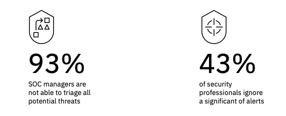

>“There is so much information out there, it’s impossible to find what’s useful.”

#### **Cyber Skills Shortage**

Coupled with the fact that industry-wide there are expected to be 1.8 million cyber jobs that will be unfilled by 2050. 

>“Workload is overwhelming and repetitive. and we cannot retain talent nor find the manpower we need.”

#### **Complexity**

Operations teams have a very challenging mission. They need to process all the intelligence to stay ahead of the cyber-criminals, protect critical data, users, applications, and infrastructure, and be prepared to respond and recover quickly from incidents.

#### **Pain points evolve as cyber-attacks increase and change**

**What are the main pain points?**

Many companies have business continuity/disaster recovery plans but are often not suited to handle destructive cyber-attacks.

Networks that are 5+ years old and hardware/appliance-based are seldom resilient. Companies affected by cyber attacks spend up to $3.6 million on recovery and breach notification, which they could have avoided by spending a portion of their budget on preparation and planning. 

There is a need for a more precise, immediate response to cyber events. Let's review the main pain points that organizations are facing as cyber-attacks increase.  

  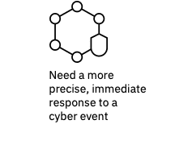
  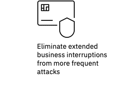
  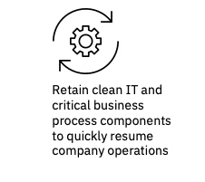
  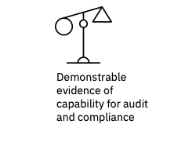

### **4. What are the key considerations to building a cyber defense strategy?**

*Cyber resilience is not just a security problem. It is not just an IT problem all areas of the business need to be involved and all the key disciplines need to be prepared to work together, share information, and seamlessly share information in real-time to address cyber threats.*

Unlike traditional outages, cyber attacks can be targeted attacks that exfiltrate IP from Research & Development, Finance, Production, and other departments.

**Important questions to build a cyber defense strategy**

Explore the following key questions that all security strategy leaders should ask, and evaluate the proposed considerations:

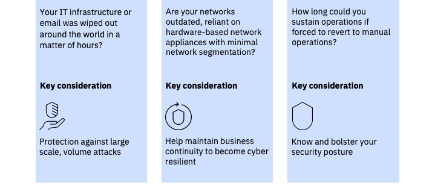

**Cyber resilience serves a number of IT and risk management disciplines**

Cyber Resilience is a business priority that supports “continuous availability” that allows companies to meet their business outcome objectives.

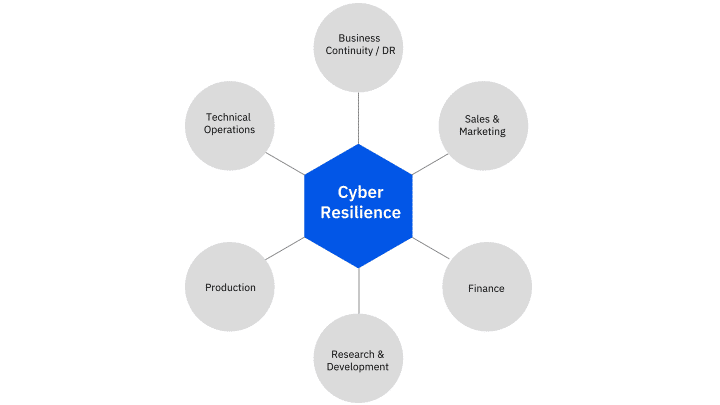

### **5. What is the IBM Cyber Resilience Lifecycle?**

*As computing technologies have progressed over time, so have the complexities that need to be managed. To solve this expectation and complexity, AI, predictive systems, and orchestration as part of a software-defined resiliency story will be critical.*

**The evolution of Cyber Resilience**

In the first wave, the trend was to have data recovered from weeks with infrastructure recovery in the data center. Typically these were singular centralized systems. 

The expectations in wave 2 for data recovery were reduced to days and cloud began to be a part of the story. 

In wave 3 expectations were that the recovery of the lost data was in the range of hours to minutes using more hybrid environments. 

The trend going forward is an expectation of always-on systems with an expectation of zero downtime which is a major challenge since our systems are now more heterogeneous than ever.

The picture below depicts the evolution timeline for disaster recovery practices

The chart illustrates the importance of cyber resilience as a business priority that supports "continuous availability" that allows companies to meet their business outcome objectives

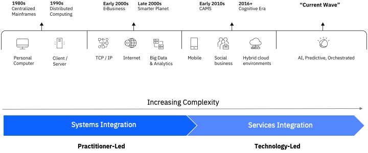

**The future is AI and Orchestration**

By proactively identifying threats you can predict emerging threats and risks, by modeling behaviors you can gain actionable insights so you can triage and respond quickly with improved accuracy, then you can respond quickly with confidence leveraging orchestration to generate a complete and dynamic response, enabling faster, more intelligent remediation

#### **Cyber Resilience Lifecycle**

Based on the NIST cyber security framework, the IBM cyber resilience lifecycle enables organizations to improve their cyber robustness across the five phases of the lifecycle.

Below are the five phases of the Cyber Resilience Lifecycle:

**Identify** – is about preparing a plan

Identify a cyber resilience plan
<ul><li>X-Force IRIS Incident Response Planning</li><li>Cyber Resilience Preliminary Assessment</li><li>Cyber Rapid Risk Readiness Assessment</li><li>Software Defined Network Planning and Assessments</li><li>Critical Data Protection Program</li><li>Program Governance</li></ul>

**Protect** – discover weaknesses before attackers can

Disaster Recovery as a Service&nbsp;

Protect against attacks by discovering vulnerabilities before they are exploited
<ul><li>X-Force Red Offensive Security</li><li>Advanced Endpoint and Network Protection</li><li>Security Infrastructure Management</li><li>Managed Guardium</li><li>Managed Web Defense</li><li>Insider Threat Detection</li><li>Backup as a Service</li></ul>

**Detect** – find unknown threats with advanced analytics and stop attacks before they become entrenched

Resiliency Orchestration with Cyber Incident Recovery

Detect unknown threats with advanced analytics &nbsp; &nbsp;
<ul><li>X-Force Threat Management &nbsp;</li><li>Managed X-Force Detection</li><li>Active Threat Assessment</li><li>X-Force Command Centers</li></ul>

**Respond** – coordinate your response so everyone is on the same page and all tasks are completed

Respond to cyber outbreaks
<ul><li>X-Force Threat Management Response</li><li>X-Force IRIS Vision Retainer</li><li>Backup as a Service</li><li>Disaster Recovery as a Service</li><li>Recovery notification workflow automation</li><li>Dynamically managed infrastructure</li></ul>

**Recover** – get back up and running quickly and efficiently

Recover access to critical data and applications

Resiliency Orchestration with Cyber Incident Recovery
<ul><li>Backup as a Service &nbsp;</li><li>Disaster Recovery as a Service</li><li>Network as a Service</li><li>X-Force IRIS Vision Retainer</li><li>MultiNetwork WAN (MWS)</li></ul>

Use the interactive activity below to explore each phase and learn more about which tools, methods, and approaches apply to each one of them.

### **Summary**

1. As cyber-attacks continue to raise the best defense is to adopt the capacity to ensure your organization can "survive" the aftermath of a cyber attack.

2. Many companies have business continuity/disaster recovery plans but are often not suited to handle destructive cyber-attacks, they should invest in renewing their infrastructure before is too late.

3. Operations teams need to process all the intelligence to stay ahead of the cyber-criminals, protect critical data, users, applications, and infrastructure, and be prepared to respond and recover quickly from incidents.

4. To achieve Cyber Resilience organizations can follow the Cyber Resilience Lifecycle, adopting an AI and Orchestration approach to security.

## **Topic 2: Why Threat Hunting?**

*The best way to protect yourself is to know your enemy*

### **Introduction**

Explore the rise of threat intelligence and hunting practices to deal with advanced threats that cause the most damage.

**Gain an understanding of the concepts covered in this lecture, by going through the videos, reading material and, slides included in the sections below:**

1. Why do we need Cyber Threat Hunting?
2. What is the Human-vs-Human approach?
3. What is the security structure within an organization?
4. What is the purpose of adversary cyber-attack models?
5. What is the IBM X-Force IRIS Cyber Attack Framework?

### **1. Why do we need Cyber Threat Hunting?**

*In order to attack the full cyber threat spectrum, an organization must embrace both information security and the natural evolution of cyber analysis which includes the use of cognitive tools and is commonly called “Cyber Threat Hunting.”*

Information security creates a foundation of security with a framework and builds upon that with some specialization and technology. Eventually, the security process evolves into cyber analysis with long-term research and ecosystem visibility concerning malicious actors.

#### **Why there is a need for Cyber Threat Hunting?**

**The sophistication of attackers is outstripping the organization's defenses**

Advanced threats in cyberspace are highly resourced, highly sophisticated bad guys that can evade detection from the rule and policy-based defenses. 

Dwell time is the time an attacker enters the network to the time of detection. The average dwell time is 191 days. This is a lot of time for the bad guys to achieve their objectives.

They dwell in the network and although advanced threats might be a smaller percentage of threats, they can cause the most damage. The longer an attacker spends in your network the more damage they can do and the higher the cost of an attack.

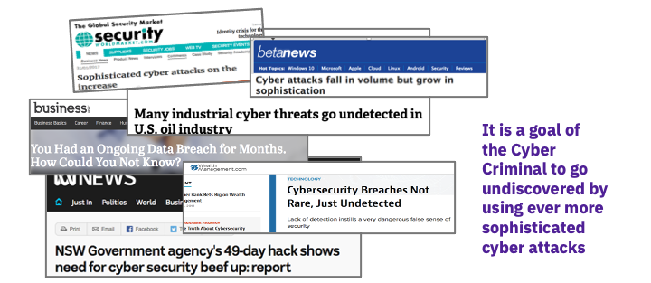

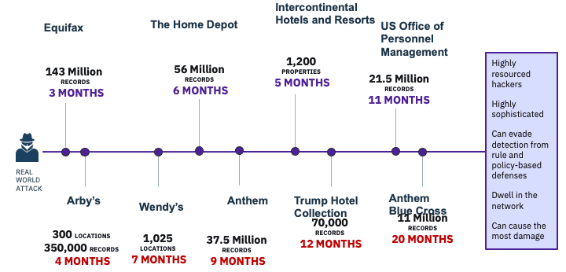

**They use sophisticated attack kits that compare with the best tools our national security agencies have available today are constantly developed and sold on the dark web.**

Sophisticated developers who spent years honing their hacking techniques can now profit from their experience by selling hacking toolkits as a software package. Exploit kits attack known vulnerabilities to deliver malicious payloads of the attacker’s choice. New exploit kits are continuously being developed with different attack vectors and infection techniques. At any given time there are dozens of exploit kits available — including Zeus variants, FlokiBot, NukeBot, and GM Bot — and the widespread use of these tools has increased the sophistication of tactics, techniques, and procedures among a full spectrum of attackers.

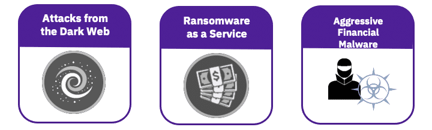

**20% of threats are unknown, undetected, and can cause the most damage**

Typically when experts discuss the breakdown of cyber threats, the 80/20 principle is brought up — meaning 80 percent of cyber actors are generally less sophisticated and the top 20 percent are so advanced that given enough time and resources they will break onto any network. Historically, the top 20 percent of actors were mainly the concern of the defense and intelligence community. 

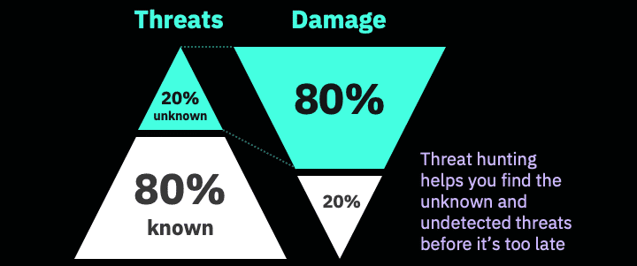

**That's the reason we need Cyber Threat Hunting**

Human-led analysis capabilities help us quickly find hidden connections and critical patterns buried in internal, external, and open-source data.

### **2. What is the Human-vs-Human approach?**

*Adversarial goals and tactics, techniques, and procedures (TTPs) can be very different for each incident, but all attacks share some core concepts that defenders can work with to expose malevolent activity before it causes damage.*

Adversarial goals and tactics, techniques, and procedures (TTPs) can be very different for each incident, but all attacks share some core concepts that defenders can work with to expose malevolent activity before it causes damage.

#### **Approach to Threat Hunting**

Why the rise in threat hunting and how does threat hunting help you deal with the undetected threats that cause the most damage? It helps you detect threats faster by proactively looking for threats instead of waiting for an alarm to go off.

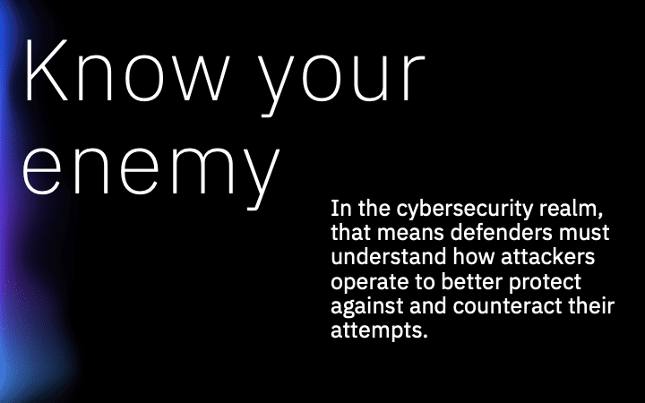

#### **Human-versus-human approach to understanding the enemy**

Policy-based security solutions such as endpoint protection, network security, and identity and access management are necessary forms of threat protection. But these solutions are even more effective when combined with the power of human insight into human behavior that can be developed through multidimensional analysis. To stay ahead of threats, security and intelligence analysts need to think like the “bad guys” they’re trying to defeat, whether that’s in the world of cybersecurity or mission intelligence.

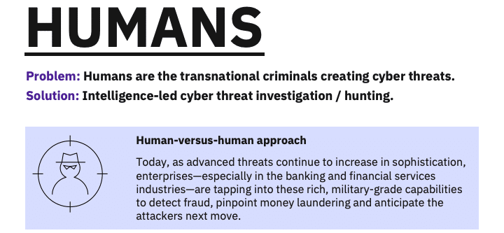

### **3. What is the security structure within an organization?**

*By connecting, analyzing, and visualizing disparate data sources time insight that can help provide unique intelligence a Security Operation Center team can detect, disrupt and defeat threat actors.*

Cyber security solutions today provide a human-versus-human approach to understanding the enemy. Powerful analytics can help analysts develop insights to understand and anticipate where threat actors might strike next.

#### **The role of Security Operation Center teams**

Security Intelligence Analyst teams in an organization are located generally within a Security Operations Center, their organizational structure and capabilities are essential to the capacity of the organization to respond and prevent a security incident.

The leverage data from different sources, including open-source and third-party data stores, whether from a human resources system, a crime database, or social media.

### **4. What is the purpose of adversary cyber-attack models?**

*To build an effective cyberattack security strategy, organizations need to thoroughly understand exactly how cyberattacks occur from the attacker’s perspective.*

See firsthand the approach cyber attackers use to get into your system, from the moment of its inception within the Dark Web of hackers, to when it is sent around the world to infect as many systems as possible.

#### **The Cyber Attacker Adversary Framework**

Some [exploits] could be malicious or hacked websites to steal information, but there are other approaches. Criminals can send highly credible-looking phishing emails to trick employees into downloading malware that gives hackers access to secure systems. These attacks continue to spread because companies don't share information with each other on how these attacks are perpetrated.

When the file is open, Malware installs on a user's device, where it can hide for months. Without the right security in place, the user suspects nothing and security tools detect nothing. The attackers are now inside the organization. They use this position to infect other systems on the network and search for sensitive information. They copy the stolen information to a remotely accessible server and wait until the opportune moment, download it, and destroy all records of the attack. 

#### **MITRE ATT&CK™ FRAMEWORK**

ATT&CK™ for Enterprise is an adversary model and framework for describing the actions an adversary may take to compromise and operate within an enterprise network. The model can be used to better characterize and describe post-compromise adversary behavior. It both expands the knowledge of network defenders and assists in prioritizing network defense by detailing the tactics, techniques, and procedures (TTPs) cyber threats use to gain access and execute their objectives while operating inside a network.

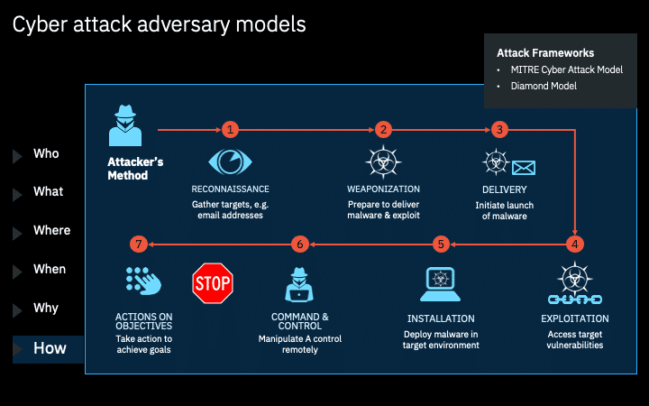

ATT&CK for Enterprise incorporates information on cyber adversaries gathered through MITRE research, as well as from other disciplines such as penetration testing and red teaming to establish a collection of knowledge characterizing the activities adversaries use against enterprise networks. While there is significant research on initial exploitation and use of perimeter defenses, there is a gap in central knowledge of adversary processes after initial access has been gained. 

ATT&CK for Enterprise focuses on TTPs adversaries use to make decisions, expand access, and execute their objectives. It aims to describe an adversary's steps at a high enough level to be applied widely across platforms, but still maintain enough details to be technically useful.

### **5. What is the IBM X-Force IRIS Cyber Attack Framework?**

*Experts within the IBM® X-Force® Incident Response and Intelligence Services (X-Force IRIS) team has developed a comprehensive framework to address all actions an attacker takes*

Empowering security analysts and threat hunters with the insight they need to narrow risk exposure and thwart ever-increasing cyberattacks.

#### **IBM X-Force IRIS Cyber Attack Framework**

The framework outlines each phase of a cyberattack so security analysts can examine them in a repeatable and comprehensive way. The phases in a cyberattack don’t necessarily happen sequentially, or at all. Depending on how the attack progresses, the phases may occur simultaneously or through multiple iterations—or may be skipped entirely.

**How does it work?**

The framework includes a Preparation phase and an Execution phase, learn more about the individual steps in each phase in the section below.

#### **IRIS Cyber Attack Framework**

**Establish a cyberattack strategy**

To effectively prevent bad actors from entering your network, take a holistic view of cyberattack techniques— from the attacker’s perspective.

The X-Force IRIS framework provides a comprehensive and repeatable analysis of each step in the attack lifecycle to empower security analysts and threat hunters to better understand, track and defend against patterns of malicious behavior.

### **Summary**

1. Threat hunting is needed because even though only 20% of the threats are unknown those are the ones that do the most damage, and unknown threats needed expert threat hunters to take action.

2. The sophistication of attackers are outstripping the organization's defenses

3. To create a comprehensive security strategy you need to know your enemy, understand their Cyber Attack Framework

## **Topic 3: Threat Hunting Methodology**

*Where human expertise, science, and technology work together to address the most dangerous cyber attacks.*

### **Introduction**

A deep dive into the threat hunting methodology.  

Questions

Gain an understanding of the concepts covered in this lecture, by going through the videos, reading material and, slides included in the sections below: 

1. What is Cyber Threat Hunting?
2. What are Tradecrafts?
3. What is the Art and Science of Threat Hunting?
4. Cyber Threat Hunting: How it Works?

### **1. What is Cyber Threat Hunting?**

*Threat hunting can be defined as “the act of aggressively intercepting, tracking and eliminating cyber adversaries as early as possible in the Cyber Kill Chain.”*

The practice uses techniques from art, science, and military intelligence, with internal and external data sources informing the science of statistical and cognitive analysis. Human intelligence analyzes the results and informs the art of a response. 

>Last year, 91% of security leaders reported improved response speed and accuracy as a result of threat detection and investigation
>-SANS Institute.

#### **The threat landscape is constantly changing**

In the physical world, new crime rings and terrorist cells continue to form; in the cyber world, threat actors are constantly crafting new ways to steal data, disrupt business and destroy reputations. Those in charge of hunting down physical and cyber threats—whether it’s the chief information security officer, the threat intelligence director, the director of fraud detection, the chief of police, or a national security leader—have a tough job to do.

**One of the greatest challenges security and intelligence analysts face is being overwhelmed by massive volumes of data from different sources. And they often lack tools that give them the ability to predict and prevent physical and cyber threats. This is a crucial gap because, for every advanced threat, there’s a human behind it.**

**Threat Hunting provides a solution**

Threat Hunting and Intelligence solutions offer cutting-edge analytics and intelligence platform that enables advanced threat-hunting with a human-versus-human approach. The solutions go beyond policy-based capabilities, to help security and intelligence analysts not only understand, but also anticipate, when and where the next threat actor will strike—whether it’s in the IT network, at the national border, or in the local streets.

#### **The Threat Hunter**

These solutions empower a new kind of cybersecurity analyst, the threat hunters, who fight cyber criminals across the public and private sector with the military-grade tools they need to outthink threat actors, arming security and intelligence analysts with tools and technology that enable them to detect, disrupt and defeat advanced cyber and physical threats by correlating and analyzing disparate data sources in near-real-time.

**So, how do Threat Hunting works?**

Threat hunting is not defined by solutions, although tools and techniques can significantly improve efficiency and outcomes. Instead, it’s defined by a widely accepted framework from Sqrrl. These are the four stages of Sqrrl’s Threat Hunting Loop:

1. Create a hypothesis.
2. Investigate via tools and techniques.
3. Discover new patterns and adversary tactics, techniques, and procedures (TTPs).
4. Inform and enrich automated analytics for the next hunt.

The goal for any security team should be to complete this loop as efficiently as possible. The quicker you can do so, the quicker you can automate new processes that will help find the next threat.

**What are the primary elements needed to conduct threat hunting and how can I define the threat landscape?**

Threat detection doesn't start with data. It starts with asking questions:

- What is the problem that an analyst needs to solve?
- Is it searching for a malicious insider who's secretly moving intellectual property data out of our network?
- Are we trying to shut down a ring of drug dealers?
- Is it searching for clandestine transactions that could indicate money laundering?

The picture below depicts the main elements to consider when looking at the dimensions considered while conducting Threat Hunting.

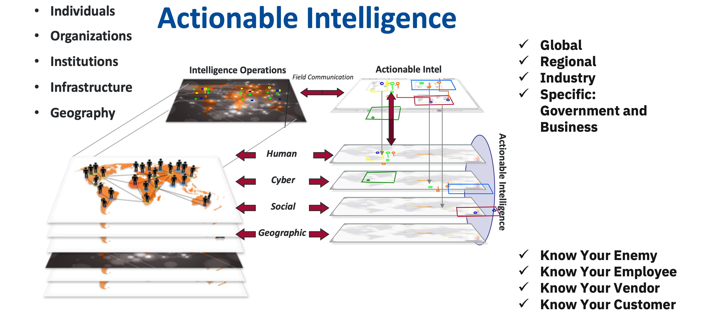

### **2. What are Tradecrafts?**

*Threat hunting isn’t simply a person or a piece of software. It’s a combination of person and machine, of art and science. Threat hunting requires a great deal of skill, concentration, collaboration, and more than a little creativity.*

These are the areas where the human mind excels. But threat hunting also requires the right technology to sift intelligence from a vast seat of data, spot anomalies in system logs, and automate the process using a global network of threat intelligence.

#### **The key to Threat Hunting**

Threat hunters use data, analytics, and visualization tools the way an artist uses a palette, putting the pieces together until a clear picture emerges. Once they create that image, threat hunters then use their investigative skills to look for potential cyber threats. As they uncover new threats, hunters rely on their expertise and close collaboration with their teams to quarantine and safely remove the threat. When the threat is over, that experience is reported and shared with security colleagues to enrich their joint threat intelligence and prevent future attacks of a similar nature.

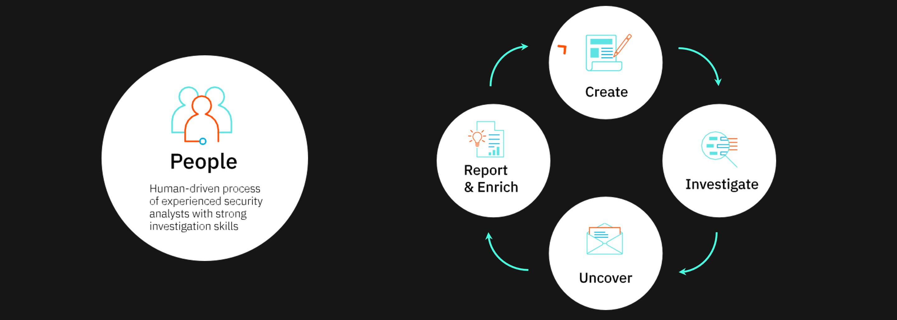

#### **Plan, Prioritize and Prepare**

It’s easy enough to spot a lion in a herd of zebras, but what do you do when everything looks like a lion?, Security analysts know that a successful hunt starts with knowing your prioritized intelligence requirements. 

Start by asking the right questions (below), then discover what data is likely to hold the answer.

- What are the main security risks we face as an organization? Data exfiltration? Ransomware? Denial-of-service attacks?

- Who needs the most protection in our organization?

- Which of our data assets hold the most value to criminals: competitive data, customer data, financial data, etc.?

- Where are we most exposed: our network, our employees, our partners?

- What kind of technology is deployed in our network, how is it used and how can it be abused?

>91% of security leaders believe threat hunting increases the speed and accuracy of their response to cyber threats.

#### **The problem is deeper than you think**

Cyberattacks often seem to present themselves all of a sudden. In reality, the most dangerous attacks often lurk undetected in your network for months before they manifest. Dwell time — the period between a cyberattack’s entry into the network and its eventual detection — is more than six months on average. It might seem that threat hunters have plenty of time to capture and kill cyber threats before they activate, but the fact that detection takes so long underscores the difficulty of doing that.

The depth of the cyber threat problem doesn’t reflect a deficiency in security technology so much as it reflects the growing proficiency of the cybercriminal community. Fraud, ransomware, and attacks-for-hire are a billion-dollar industry, and cybercrime organizations treat their operations like profitable businesses. They innovate, they disrupt and they’re constantly on the lookout for ways to increase their ROI. They also use multi-pronged attacks outside the view of traditional security systems to plant the seeds for their nefarious activities.

Organizations that master the art and science of threat hunting can reduce dwell time from months to minutes. Experience shows that the more time a cyberattack spends in your systems, the more damage it does: to your customers, your business, your brand reputation, and your bottom line.

### **3. What is the Art & Science of Threat Hunting?**

*The science of threat hunting is a holistic discipline that integrates internal data, external data and intelligence, statistical analysis, and intelligence analysis to give threat hunters better visibility into hidden threats.*

You can think of this technology as the threat hunter’s night-vision goggles; without it, they’re looking for a black hat in a dark forest.

#### **How to combine art and science to perform Threat Hunting?**

Standard security tools are great at detecting and blocking the known 80 percent of cyberattacks that come flooding into your network every day. But it’s the perilous 20 percent you don’t know about that presents the biggest risk to your organization. How do you find what you don’t know? By giving threat hunters better tools to hunt with, including data from different sources and advanced analytics to help them identify new patterns, models, and behavior.

##### **Threat Hunting Elements**

Threat hunting requires the combination of different elements to be brought together so the threat hunter can perform their analysis and consideration, the main elements threat hunters utilize to perform their work are listed below:

**1. Internal Data and Systems**

>Internal data and systems represent aggregated data from the entire organization, including data that might not typically appear as part of a Security Incident and Event Management (SIEM) tool, such as human resources information and emails. This data can help threat hunters create richer user profiles, set alerts, and rules, and correlate their hypotheses around unknown threats.

**2. External Data and Intelligence**

>External data and intelligence bring in threat intelligence from the wild. With these tools, threat hunters can manually analyze where data points intersect, connect internal and external data to expose new risks, confirm events such as hijacked accounts and bring non-traditional, unstructured data (e.g., social media posts, news feeds, data on the dark web) into the light for deeper analysis.

**3. Statistical Analysis**

>Statistical analysis tools help threat hunters detect anomalies, patterns, and relationships in the data that could indicate the presence of a threat. It’s here that you’ll find next-generation security systems such as User and Entity Behavior Analytics (UEBA), which allow security analysts to quickly identify abnormal behavior by setting a baseline definition for what constitutes “normal” user behavior.

**4. Intelligence Analysis**

>Intelligence analysis includes advanced visualization tools that assist threat hunters in quickly investigating and researching correlations and links. These tools can be used to view a user’s risk profile, track their activities over a timeline, identify trends, chart geospatial relationships, and more.

##### **How do we get started?**

Before you start to hunt, you need to understand what to look for, those would be your PIR or Prioritized Intelligence Requirements, to identify those you need to start by asking the following questions:

- What are your key risks?

- Who are you most worried about protecting in your organization?

- What is your biggest exposure?

- (Assets, People, Systems, Networks)

- How do those outside see you – both physically and virtually?

The below table shows an example of the PIR analysis results of a Threat Hunter:

|Prioritized Intelligence Requirement (PIR)|Indicator|Named Area of Interest (NAI)|Last Time Information of Value (LTIOV)|Reporting|
|----|----|----|----|----|
|Is there evidence of additional weaponized ransomware leveraging Equation Group exploits?|External: community discussion, DW planning, Internal: scanning, related open ports, creation of certain files|Darkweb intelligence feeds, community forums, NW data, VM data|N/A|CCIR#3, FPCON Bravo|
|Are there indications of a similar nonPetya ransomware attack against similar companies?|External: pharma reporting issues, LE alerts, Internal: similar scans, targeted industry phishing attacks|Darkweb intelligence feeds, community, FBI, DHS, forums, NW data, VM data, Proofpoint|N/A|CCIR#4, FPCON Bravo|

#### **What are Prioritized Intelligence Requirements (PIR)?**

A PIR is a question that drives intelligence collection, whose answer will ultimately drive a decision affecting the success of an organization.

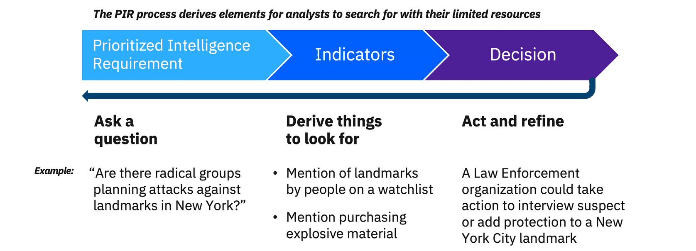

#### **Case Study: Cyber PIRs Real-World Example – Ukraine Case Study**

Experts believed NonPetya was a politically-motivated attack against Ukraine by Russia, since it occurred on the eve of the Ukrainian holiday Constitution day and was targeted against a Ukrainian software company. 

##### **What are the questions leading to the identification of our PIRs?**

Are there global or geopolitical events that may precipitate an additional attack from Russian state actors?

- What software or updates have the potential of enterprise-wide proliferation like M.E.Doc? What software have automated updates that can cause system-wide infection?

- Is there any activity on the dark web indicating a new variant of NonPetya or similar ransomware?

- Are all the administrators practicing least privilege access in the case of account compromise?

- Are there indications of a similar NonPetya ransomware attack against similar companies?

- What new proliferation techniques for ransomware are being discussed on the dark web?

- Is there evidence of additional weaponized ransomware leveraging Equation Group exploits?

##### **What are the internal PIRs?**

- Which machines have rebooted in the middle of the day (Infected machines are rebooted within 10-60 mins of infection). Indicators: system logs, server logs, endpoint (EDR) data

- What Network Scanning is occurring on SMB ports - Each and every IP on the local network and each server found is checked for open TCP ports 445 and 139. Indicators: netflow, packet capture, vulnerability scanning

- What machines have ports 137, 138, 139, and 445 open? Indicators: vulnerability scanning

- Which machines are not patched for any of the related Equation Group exploits, specifically Eternal Romance? Indicators: vulnerability scanning

- What machines have created pefc.dat? Creating the read-only file C:\Windows\perfc.dat on your computer prevents the file-scrambling part of NotPetya from running, but doesn't stop it from spreading on the network. Indicators: Syslogs, EDR

- Which machines are executing PsExec and WMIC in unusual ways, for example, would be low entropy indicated a variation in use when compared to normal Administrator commands? Indicators: command line, EDR, analyzed with statistical analysis tools

- Are all the administrators practicing least privilege access in the case of account compromise?

- Which software or updates have the potential of enterprise-wide proliferation like M.E.Doc? Which software has automated updates that can cause system-wide infection?

##### **What are the external PIRs?**

- Is there any activity on the dark web indicating a new variant of NonPetya or similar ransomware?

- Are there indications of a similar nonPetya ransomware attack against similar companies on the dark web?

- What new proliferation techniques for ransomware are being discussed on the dark web?

- Is there evidence of additional weaponized ransomware leveraging Equation Group exploits?

- Experts believed nonPetya was a politically-motivated attack against Ukraine by Russia, since it occurred on the eve of the Ukrainian holiday Constitution day and was targeted against a Ukrainian software company. Are there global or geopolitical events that may precipitate an additional attack from Russian state actors?

### **Summary**

1. One of the greatest challenges security and intelligence analysts face is being overwhelmed by massive volumes of data from different sources.

2. Threat hunters, need to outthink threat actors, arming with tools and technology that enable them to detect, disrupt and defeat advanced cyber and physical threats by correlating and analyzing disparate data sources in near-real-time.

3. Threat detection doesn't start with data. It starts with asking questions. What is the problem that an analyst needs to solve?

4. A PIR is a question that drives intelligence collection, whose answer will ultimately drive a decision affecting the success of an organization.

## **Summary**

1. The key to a good defense is to know your enemy. 

2. In the cybersecurity realm defenders must understand how attackers operate to better protect against and counteract their attempts.

3. MITRE ATT&CK™ for Enterprise is an adversary model and framework for describing the actions an adversary may take to compromise and operate within an enterprise network.

4. Threat hunting can be defined as “the act of aggressively intercepting, tracking and eliminating cyber adversaries as early as possible in the Cyber Kill Chain.”

5. Before you start to hunt, you need to understand what to look for i.e. your Prioritized Intelligence Requirements (PIR)