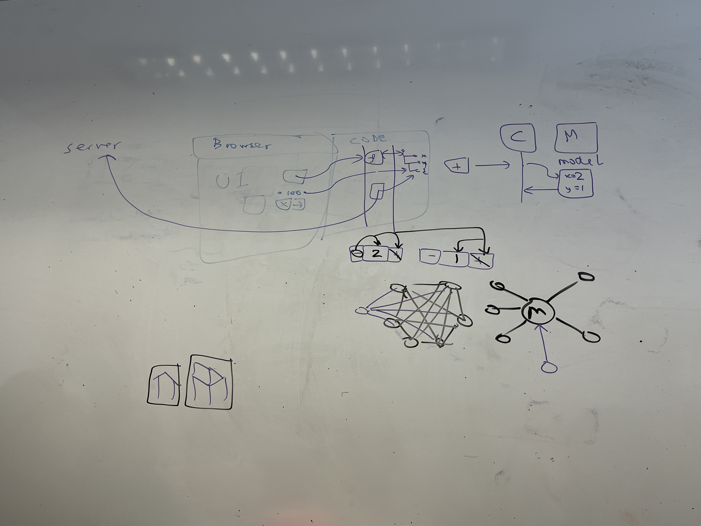

# 5.9-Meeting
## Meeting with David & John:
 

  

### 1. Game structure  
3 layers in the backend: (1)Database access layer (2)Model/entity layer (3)View layer (interact with frontend)
### 2. Game engine
Web frontend 2D game engine (to be decided)
### 3. Game type
A web application City Building Game
### 4. Game resources
(1)Learning materials from the IBM SkillsBuild website (about 20-30 tutorials) 
(2)Art materials from the open source library  
### 5. Tools
No necessity to use IBM series tools
### 6. Game details
(1)Difficulties on user login, data storage  
(2)Do not need AI players, but can have an AI chatbot (like from IBM Watson) to guide the player and give tutorials  
(3)Initial inhabitants/buildings - get the question right, get gold (or something similar), build a building, population grows - get the question wrong, building decreases, population decreases
### 7.Report & Pre
(1)Time: not decided by uni yet, but most likely will be in early September
(2)Could be online  
(3)Group report + Individual report: discussion + decision + most challenge things...
### 8. Meeting time
(1)With David: about every 2 weeks offline meeting
(2)With John: appoint in advance as required

 

## TODO
### 1. Deciding on a game engine and learn
### 2. (?) Redo a RAG score (relevant to game) spreadsheet as requested by John
### 3. Dividing the overall structure of the front and back ends

